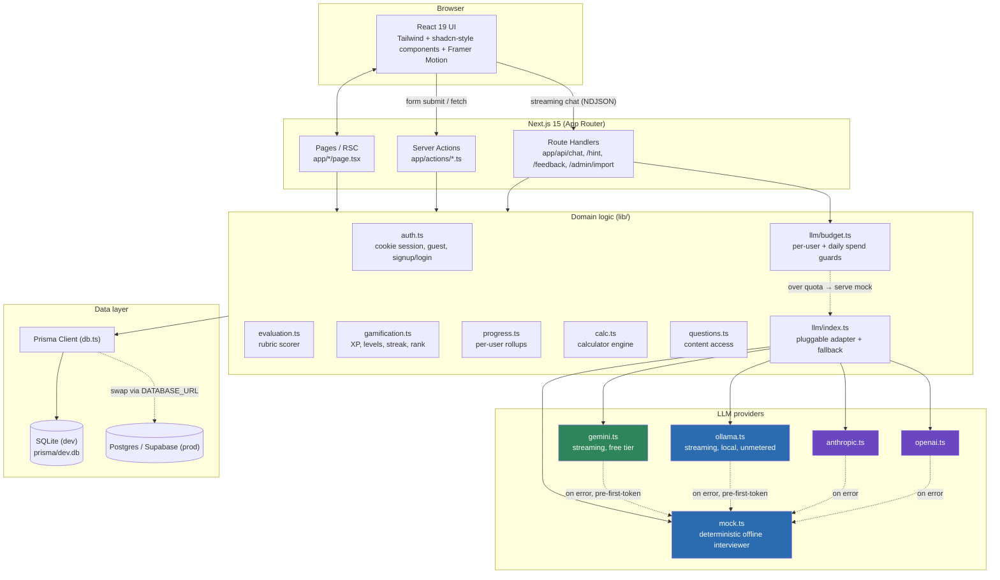
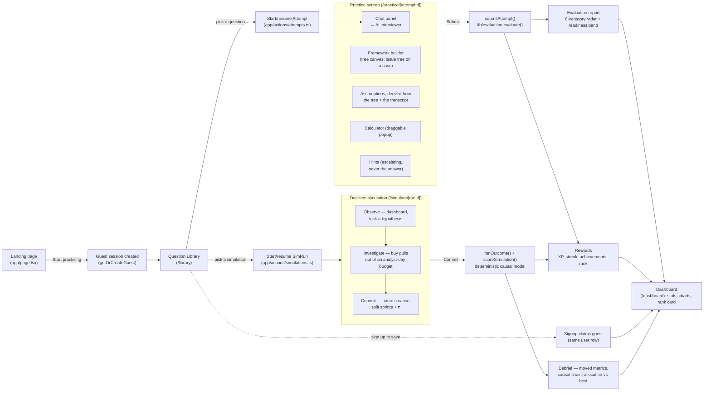
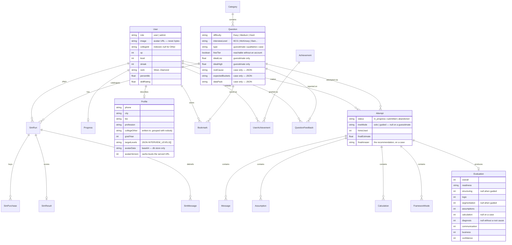
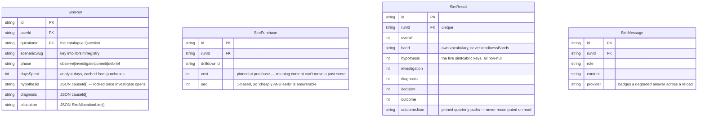
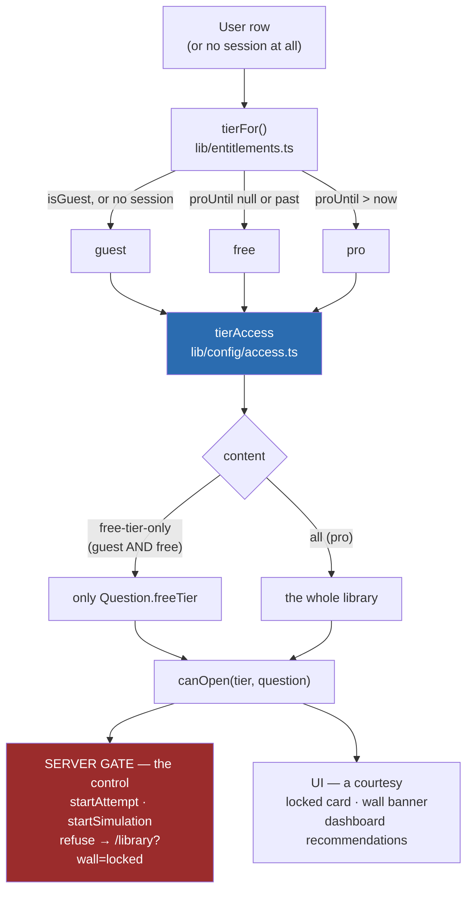
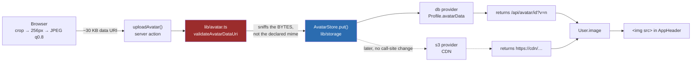
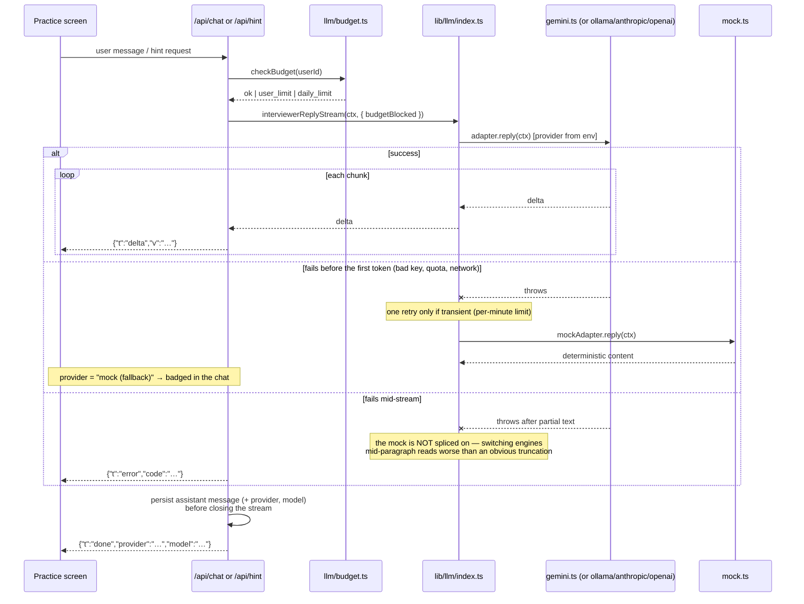
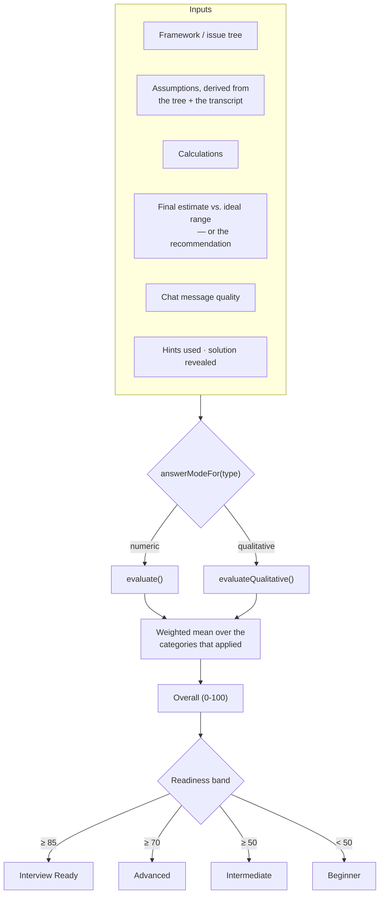
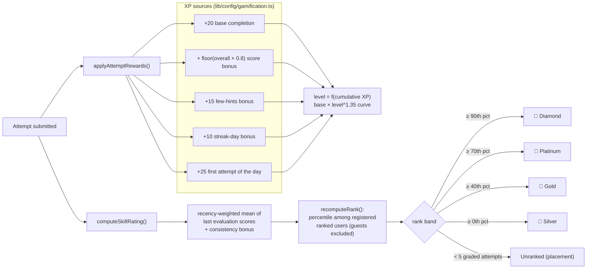
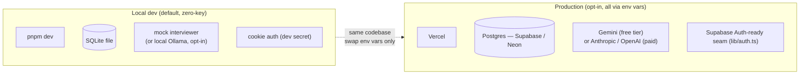

# EstimateIQ — Architecture & Documentation

EstimateIQ is a **local-first, zero-key** Next.js app that lets MBA / consulting / PM
candidates practise India-focused market-sizing guesstimates and business cases against
an AI interviewer, then get a scored evaluation and gamified progress (XP, levels,
streaks, percentile rank).

This document is the visual companion to the root [`README.md`](../README.md): it covers
system architecture, the request/data flow, the data model, and the scoring & gamification
rules, each with a diagram.

For what the gamification in section 6 does *not* yet do — and the retention loop planned
around it — see [`RETENTION.md`](./RETENTION.md).

---

## 1. System architecture

Next.js 15 App Router serves both the UI (React Server Components) and the backend
(Server Actions + a few Route Handlers) from one deployable unit. Prisma is the only way
any code touches the database.



**Key principle:** every external dependency (LLM, database, auth provider) sits behind a
narrow interface in `lib/`, so the app runs fully offline by default and upgrades to real
services purely through environment variables (see root README, "Enabling a real LLM").

---

## 2. End-to-end user flow

A guest can complete the entire core loop — practice → evaluation — with zero signup.
Signing up "claims" the guest's history in place.



The two loops share a user, XP and a streak, and nothing else. A simulation writes no `Attempt`
and no `Evaluation`, so `updateProgress` and `recomputeRank` cannot see it — that is what keeps
interview readiness and percentile rank measuring only interview work.

---

## 3. Data model (Prisma / SQLite → Postgres)



**Two question types, one pipeline.** `answerModeFor(type)` (`lib/types.ts`) maps a
question to `numeric` or `qualitative`, and everything downstream — the builder, the
scorer, the prompts — branches on that rather than on `type` itself. A nullable score
means "this category never applied to this attempt", which is a different claim from
zero and is preserved as one all the way into the database.

### The simulation tables



**Why these are not `Attempt` and `Evaluation`.** `updateProgress` and `recomputeRank`
(`lib/progress.ts`) query `Attempt` + `Evaluation` directly, as does `lib/admin-stats.ts`. Had a
simulation written an `Evaluation`, keeping interview readiness honest would depend on remembering
an exclusion filter at four-plus query sites, forever. Separate tables mean there is no filter to
forget — `lib/progress.ts` did not change when simulations were added. The nine `Evaluation`
columns are also named for interview behaviours (`segmentation`, `calculation`) and would have
poisoned `Progress.bySkill` and the dashboard radar.

`SimPurchase` carries a unique constraint on `(runId, drilldownId)`: a double-click must not be
charged twice for the same cut.

### Admin driver overrides

`SimScenarioOverride` is the one simulation table that holds *content* rather than a run. It stores
a JSON `SimDriver[]` keyed by scenario slug — an override of the graph authored in code, never a
replacement for the scenario.

```
lib/sim/registry.ts     authored scenarios, pure, sync    ← the default
        │
lib/sim/overlay.ts      parse → merge → re-validate       ← pure, falls back on failure
        │
lib/scenario-store.ts   + SimScenarioOverride             ← server-only, what pages call
```

The ordering is the design. Code is the default, so an empty table is a working app, `db:reset` is
harmless, and the test suite still exercises the real authored numbers. Only `drivers` is
overridable: causes, drilldowns and interventions reference driver ids, and letting both sides move
at once turns one bad save into a scenario that no longer agrees with itself.

**Where each guarantee is enforced.** Authored scenarios were checked once by CI before they could
ship. Runtime editing has no such gate, so `saveScenarioDrivers` runs the same three checks against
the merged scenario before writing: a Zod parse (shape), `validateScenario` (cross-references), and
`checkBalance` (that `bestAllocation` is still the best affordable play). The third is the one worth
naming — it is the ceiling `scoreOutcome` normalises against, so an edit that dethrones it leaves a
scenario that renders and scores normally while grading against a ceiling that is not the top.
`checkBalance` moved out of `tests/sim-scenario.test.ts` into `lib/sim/balance.ts` for exactly this
reason: one implementation, called by both the suite and the save path.

Loading re-runs the shape and structure checks and falls back to the authored scenario if either
fails, because a *code* change can invalidate a stored override that was valid when saved. Balance
is not re-run per load — 2^n outcome projections is a save-time cost, not a render-time one — so the
admin editor surfaces a rejected override with its reason and offers an on-demand re-check.

### The teaching layer

Almost every scenario carries a `teaching` block — an authored **concept primer** and an opt-in
**metric map**. The two are gated separately and deliberately: the primer is vocabulary, which is a
barrier rather than a clue, so it ships on all but the oldest scenario. The map is structure, which
on a hard scenario is most of the answer, so `toClientScenario` ships it only when the scenario
opts in. The map is derived from the driver graph by `lib/sim/metric-map.ts` rather than drawn, so
it cannot disagree with the arithmetic it explains, and drift and intervention effects stay
server-side either way — it shows how metrics relate and never which lever fixes them.

`validateScenario` enforces what `difficulty: "Easy"` promises — at most six drilldowns, six
causes one level deep, five interventions, a budget covering about half the board, and a primer.
Otherwise "simpler" decays one scenario at a time.

---

## 3a. Access tiers (and the road to freemium)

A guest reaches one guesstimate, one case and one simulation. Everything else needs an
account. The rule is a property of a *tier* rather than of a user row, which is what keeps a
future paid plan from becoming a scavenger hunt through every call site.



**One function, both callers.** The card and the gate call the same `canOpen`. Anything else
and the two drift: either the app offers what the server refuses, or it hides what the server
would have allowed. The card is decoration — a forged Server Action call with a locked
question id is bounced by `startAttempt` exactly like a click would have been.

**The freemium switch was one line.** `tierAccess` is the only place that says what a tier
reaches, so turning the paywall on meant setting `free` to `content: "free-tier-only"` and
giving it an `upgrade`. No gate, card, banner or recommendation changed — they were all
written against the table. `recommendQuestions` takes the tier as a *required* argument for
the same reason: recommending something the user cannot open is a worse failure than not
recommending, so the safe case must not be the one you have to remember to ask for.

**Pro is a deadline, not a subscription.** `User.proUntil` is one nullable timestamp and
`tierFor()` compares it against `now`, which is why there is no cron, no renewal job and no
stored tier label to fall out of sync — an expired pass is simply not greater than now.
`nextProUntil` (`lib/billing.ts`) extends rather than resets, so a second grant adds to what
is left instead of confiscating it. Nothing is purchasable yet: `grantPro` in
`app/actions/admin.ts` is the sole entry point, and it is the seam a payment webhook will call
once one exists.

**Both gates resume before they refuse.** An attempt or a run already under way stays openable
even if its question is un-flagged underneath it. Stranding a half-built tree, or a war room
with analyst-days already spent, to enforce a merchandising decision is not a trade worth
making.

**`freeTier` is not part of the authoring contract** (`lib/question-schema.ts`). Whether a
question is good and whether it is given away are different decisions, and putting the flag in
`toQuestionColumns` would let every admin edit and every CSV re-import reset it. It is written
by the seed and by one dedicated action, `setQuestionFreeTier` — which is also the only
control that works on a simulation, whose catalogue row the question form deliberately refuses
to edit.

---

## 3b. Profile, and the avatar seam

`Profile` is a 1:1 side table for the same reason `Progress` is one, and the reason is a single
fact: **`getSessionUser()` returns the whole `User` row on every page in the app.** A bio, a
phone number and a base64 photo living there would be serialised into every payload the app
sends, to render a header that needs none of them.

So the split is by *access pattern*, not by how profile-shaped a field feels. Anything queried,
grouped or ranked by stays on `User` — `collegeId`, indexed, sitting beside the `skillRating` a
cohort ranking would read. Anything shown only when someone opens their own profile lives on
`Profile`.



**`put()` returns a URL, and that is the whole seam.** The built-in provider hands back a route
path and serves the row; an object store would hand back a CDN address. `User.image` stores
whichever, every render is an ``, and nothing downstream can tell which answered.

**The browser resize is a convenience; the server check is the control.** A Server Action
accepts whatever it is sent, so `validateAvatarDataUri` reads the type out of the leading magic
bytes and returns *that* as the mime to store — the declared `data:image/jpeg` is a claim by
the caller. It matters specifically because the bytes are served back from our own origin with
the stored `Content-Type`. SVG is refused outright: a document that can carry script is not an
image. The size is capped against the base64 string *before* anything is decoded.

`avatarVersion` rides in the served URL's query string, which is what makes
`Cache-Control: immutable` truthful — a replaced photo is a new URL, so a cached copy is never
the wrong one.

**Goals are the only part of a profile that changes behaviour**, and they reuse
`INTERVIEW_LEVELS` rather than a parallel vocabulary, so a stated goal is directly expressible
as a library filter. `recommendQuestions` runs preference passes that are skipped entirely when
no goals are set — a provable no-op for anyone without a profile, which is what makes turning
personalisation on safe.

One naming trap worth recording: `User.onboardedAt` means *"has seen the practice-screen
tutorial"* and nothing else. The profile step is `profileCompletedAt`, deliberately named apart
from it, because one column for both would silently suppress the tutorial for anyone who filled
in their profile first.

---

## 4. LLM interviewer: streaming adapter with safe fallback



Two design points worth keeping:

- **The failure split is deliberate.** Before any text has streamed, the user has seen nothing, so
  serving the mock produces a complete, coherent answer. Once real text is on screen, splicing mock
  output onto the end would change voice and reasoning mid-paragraph — worse than a visibly
  truncated reply. `tests/llm-stream.test.ts` pins both halves.
- **Degradation is always visible.** Any mock-produced turn is persisted with its `provider` and
  badged "offline interviewer" in the chat, so a downgraded answer is never mistaken for the model's.
- **The spend guards apply only to metered providers** (`isMeteredLlm` in `lib/config/env.ts`).
  `ollama.ts` runs a local model that bills nothing, so blocking its turns would substitute the
  mock for the very thing under development while looking like a normal session.

The mock adapter is deliberately **deterministic and rule-based** (never reveals the
answer early), so `pnpm test` can assert interviewer behavior without any network calls.

---

## 5. Evaluation rubric

There are 9 categories in `lib/config/evaluation.ts`, and no attempt is scored on all of
them. Each carries two weights — one for a guesstimate, one for a case — and a weight of
0 takes it out of that mode entirely. The weighted mean renormalises over whatever
applied, so a case scored on 7 categories and an estimate scored on 8 land on the same
0–100 scale, and XP, rank and the readiness bands need no per-mode arithmetic.



| Category | Guesstimate | Case | Not scored when |
|---|---|---|---|
| Problem Structuring | ×1.4 | ×1.0 | guided attempt |
| Logical Thinking | ×1.2 | ×1.2 | — |
| Segmentation / MECE Coverage | ×1.3 | ×1.0 | guided attempt |
| Assumption / Rationale Quality | ×1.2 | ×1.2 | — |
| Calculation Accuracy | ×1.2 | — | case (no arithmetic) |
| Diagnosis | — | ×1.6 | no declared root cause |
| Communication | ×0.9 | ×1.0 | — |
| Business Sense | ×1.0 | ×1.2 | — |
| Confidence | ×0.8 | ×0.8 | — |

Structure is worth less on a case — the frameworks recur, so reproducing one isn't the
skill — and Diagnosis carries that weight instead, because localising the problem inside
a known tree is the hard part.

**Help is priced, not free.** Hints cost Confidence as they escalate, and Teacher mode —
the one AI mode whose prompt actually works the problem — costs the equivalent of the
whole hint ladder. A guided tree isn't scored on structure at all, because the app built
it. Each is derived from what was persisted (`Message.mode`, `Attempt.treeMode`) rather
than tracked separately, and each is disclosed in the report.

---

## 6. Gamification & percentile rank

XP/levels reward *activity*; rank rewards *quality* — they are deliberately decoupled.



---

## 7. Directory guide

```
app/
├── actions/          Server Actions — the app's real "API" (auth, practice, submit, admin, user)
├── api/               Route Handlers for streaming/chat-style endpoints (chat, hint, feedback, admin import)
├── admin/             Admin panel (question/category CRUD, import, feedback queue,
│                       simulation driver overrides)
├── dashboard/         Stats, charts, rank card, achievements
├── library/           Browse/filter questions
├── practice/[id]/     Core interviewer + calculator + framework + evaluation UI
├── simulate/[runId]/  Decision simulation: dashboard, drilldown market, commit, debrief
└── (login|signup|forgot-password)/   Auth pages

components/
├── ui/                shadcn-style primitives (button, card, dialog, tabs, ...)
├── practice/           Chat panel, calculator, framework builder, tools panel, evaluation report
├── simulation/         Sim dashboard panels, metric map, concept primer, drilldown market,
│                       commit panel, debrief report, coach
├── dashboard/          Charts (Recharts), stat cards, rank card, achievements
├── admin/              Question/category managers, CSV/JSON import, feedback queue,
│                       scenario driver editor
└── marketing/          Landing page sections

lib/
├── config/            Central typed config: env, access tiers, evaluation weights, gamification curve,
│                       practice defaults, profile vocabularies, the curated college list
├── storage/            Avatar bytes behind an AvatarStore interface (db today; S3 is a file + a case)
├── entitlements.ts     What a tier may open — pure, shared by the server gates and the UI
├── avatar.ts           Upload validation (magic-byte sniffing), URL building, initials — pure
├── profile-schema.ts   The profile authoring contract, shared by /profile and /welcome
├── profile.ts          Profile reads, and the rule for pre-applying goals to the library
├── llm/                Streaming interviewer adapters (mock / gemini / ollama / anthropic / openai),
│                       prompt builder, NDJSON protocol (stream.ts), spend guards (budget.ts)
├── sim/                Simulation engine — all pure, no DB: types, scenarios/, registry,
│                       drivers (metric DAG incl. quotient/constant), outcome (causal model),
│                       investigate (pricing), score, debrief, metric-map (derived teaching
│                       view), redact (client projection), payload, validate,
│                       balance (best-allocation invariants), overlay (admin driver overrides)
├── auth.ts             Signed cookie sessions, guest mode, claim-on-signup
├── evaluation.ts       Rubric scorer (pure, unit-tested)
├── gamification.ts     XP/level/streak/rank rules (pure, unit-tested)
├── calc.ts             Calculator expression engine (pure, unit-tested)
├── progress.ts         Per-user rollups (totals, accuracy, by-category/by-skill)
├── simulations.ts      Simulation data access (runs, purchases, results) — the only file
│                       that touches Prisma for a sim, so lib/sim stays pure
├── scenario-store.ts   Scenario loading with admin overrides applied, always falling back
│                       to the authored scenario in lib/sim/registry
└── questions.ts / db.ts  Content access, Prisma client singleton

prisma/
├── schema.prisma       Data model (see ERD above)
└── seed-data.ts / seed.ts   15 categories, 38 India-only questions (24 guesstimates
                             + 2 cases + 12 simulation catalogue rows), 12 achievements,
                             demo users, benchmark cohort
```

---

## 8. Deployment topology



---

*Diagrams are [Mermaid](https://mermaid.js.org/) and render natively on GitHub. For deep
dives on any single subsystem (evaluation rubric weights, XP curve, rank bands), see the
config files under `lib/config/`, which are intentionally the single source of truth.*
