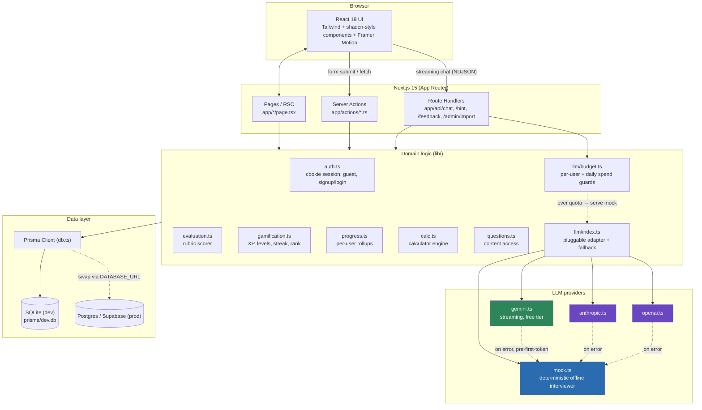
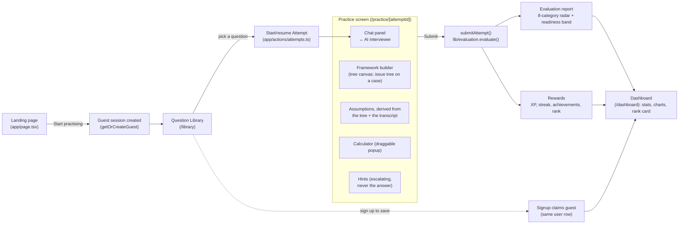
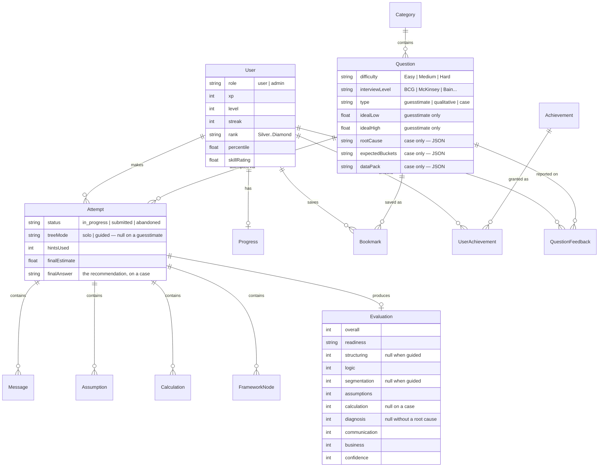
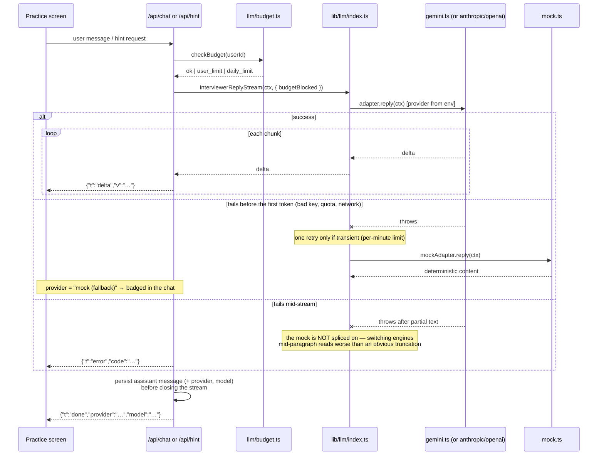
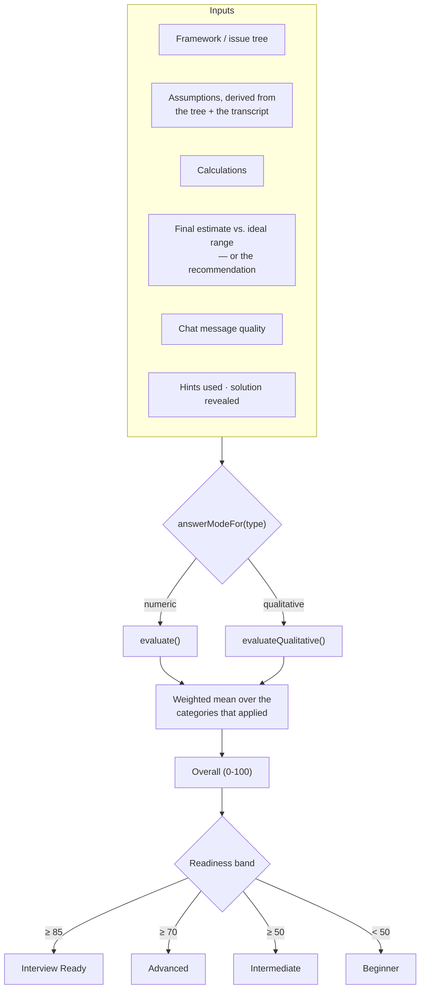
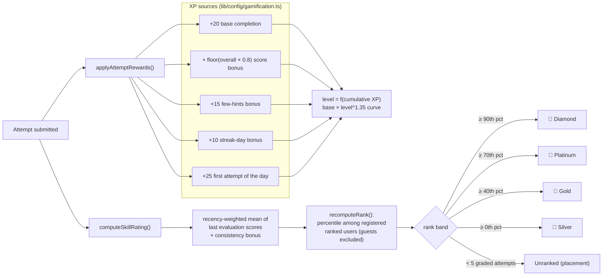
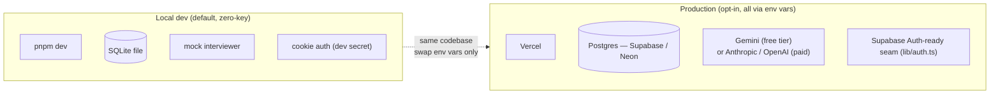

# EstimateIQ — Architecture & Documentation

EstimateIQ is a **local-first, zero-key** Next.js app that lets MBA / consulting / PM
candidates practise India-focused market-sizing guesstimates and business cases against
an AI interviewer, then get a scored evaluation and gamified progress (XP, levels,
streaks, percentile rank).

This document is the visual companion to the root [`README.md`](../README.md): it covers
system architecture, the request/data flow, the data model, and the scoring & gamification
rules, each with a diagram.

---

## 1. System architecture

Next.js 15 App Router serves both the UI (React Server Components) and the backend
(Server Actions + a few Route Handlers) from one deployable unit. Prisma is the only way
any code touches the database.



**Key principle:** every external dependency (LLM, database, auth provider) sits behind a
narrow interface in `lib/`, so the app runs fully offline by default and upgrades to real
services purely through environment variables (see root README, "Enabling a real LLM").

---

## 2. End-to-end user flow

A guest can complete the entire core loop — practice → evaluation — with zero signup.
Signing up "claims" the guest's history in place.



---

## 3. Data model (Prisma / SQLite → Postgres)



**Two question types, one pipeline.** `answerModeFor(type)` (`lib/types.ts`) maps a
question to `numeric` or `qualitative`, and everything downstream — the builder, the
scorer, the prompts — branches on that rather than on `type` itself. A nullable score
means "this category never applied to this attempt", which is a different claim from
zero and is preserved as one all the way into the database.

---

## 4. LLM interviewer: streaming adapter with safe fallback



Two design points worth keeping:

- **The failure split is deliberate.** Before any text has streamed, the user has seen nothing, so
  serving the mock produces a complete, coherent answer. Once real text is on screen, splicing mock
  output onto the end would change voice and reasoning mid-paragraph — worse than a visibly
  truncated reply. `tests/llm-stream.test.ts` pins both halves.
- **Degradation is always visible.** Any mock-produced turn is persisted with its `provider` and
  badged "offline interviewer" in the chat, so a downgraded answer is never mistaken for the model's.

The mock adapter is deliberately **deterministic and rule-based** (never reveals the
answer early), so `pnpm test` can assert interviewer behavior without any network calls.

---

## 5. Evaluation rubric

There are 9 categories in `lib/config/evaluation.ts`, and no attempt is scored on all of
them. Each carries two weights — one for a guesstimate, one for a case — and a weight of
0 takes it out of that mode entirely. The weighted mean renormalises over whatever
applied, so a case scored on 7 categories and an estimate scored on 8 land on the same
0–100 scale, and XP, rank and the readiness bands need no per-mode arithmetic.



| Category | Guesstimate | Case | Not scored when |
|---|---|---|---|
| Problem Structuring | ×1.4 | ×1.0 | guided attempt |
| Logical Thinking | ×1.2 | ×1.2 | — |
| Segmentation / MECE Coverage | ×1.3 | ×1.0 | guided attempt |
| Assumption / Rationale Quality | ×1.2 | ×1.2 | — |
| Calculation Accuracy | ×1.2 | — | case (no arithmetic) |
| Diagnosis | — | ×1.6 | no declared root cause |
| Communication | ×0.9 | ×1.0 | — |
| Business Sense | ×1.0 | ×1.2 | — |
| Confidence | ×0.8 | ×0.8 | — |

Structure is worth less on a case — the frameworks recur, so reproducing one isn't the
skill — and Diagnosis carries that weight instead, because localising the problem inside
a known tree is the hard part.

**Help is priced, not free.** Hints cost Confidence as they escalate, and Teacher mode —
the one AI mode whose prompt actually works the problem — costs the equivalent of the
whole hint ladder. A guided tree isn't scored on structure at all, because the app built
it. Each is derived from what was persisted (`Message.mode`, `Attempt.treeMode`) rather
than tracked separately, and each is disclosed in the report.

---

## 6. Gamification & percentile rank

XP/levels reward *activity*; rank rewards *quality* — they are deliberately decoupled.



---

## 7. Directory guide

```
app/
├── actions/          Server Actions — the app's real "API" (auth, practice, submit, admin, user)
├── api/               Route Handlers for streaming/chat-style endpoints (chat, hint, feedback, admin import)
├── admin/             Admin panel (question/category CRUD, import, feedback queue)
├── dashboard/         Stats, charts, rank card, achievements
├── library/           Browse/filter questions
├── practice/[id]/     Core interviewer + calculator + framework + evaluation UI
└── (login|signup|forgot-password)/   Auth pages

components/
├── ui/                shadcn-style primitives (button, card, dialog, tabs, ...)
├── practice/           Chat panel, calculator, framework builder, tools panel, evaluation report
├── dashboard/          Charts (Recharts), stat cards, rank card, achievements
├── admin/              Question/category managers, CSV/JSON import, feedback queue
└── marketing/          Landing page sections

lib/
├── config/            Central typed config: env, flags, evaluation weights, gamification curve, practice defaults
├── llm/                Streaming interviewer adapters (mock / gemini / anthropic / openai),
│                       prompt builder, NDJSON protocol (stream.ts), spend guards (budget.ts)
├── auth.ts             Signed cookie sessions, guest mode, claim-on-signup
├── evaluation.ts       Rubric scorer (pure, unit-tested)
├── gamification.ts     XP/level/streak/rank rules (pure, unit-tested)
├── calc.ts             Calculator expression engine (pure, unit-tested)
├── progress.ts         Per-user rollups (totals, accuracy, by-category/by-skill)
└── questions.ts / db.ts  Content access, Prisma client singleton

prisma/
├── schema.prisma       Data model (see ERD above)
└── seed-data.ts / seed.ts   14 categories, 26 India-only questions (24 guesstimates
                             + 2 cases), 8 achievements, demo users, benchmark cohort
```

---

## 8. Deployment topology



---

*Diagrams are [Mermaid](https://mermaid.js.org/) and render natively on GitHub. For deep
dives on any single subsystem (evaluation rubric weights, XP curve, rank bands), see the
config files under `lib/config/`, which are intentionally the single source of truth.*
