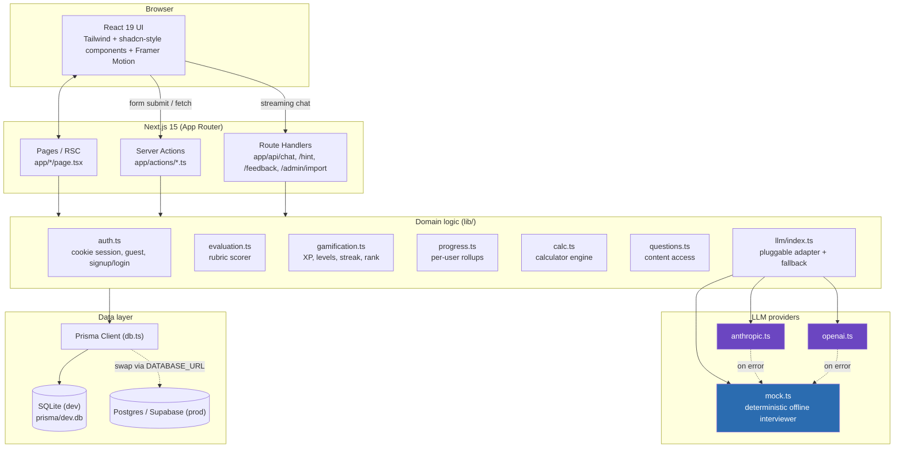
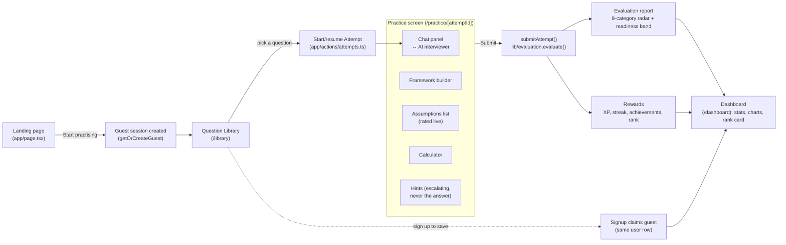
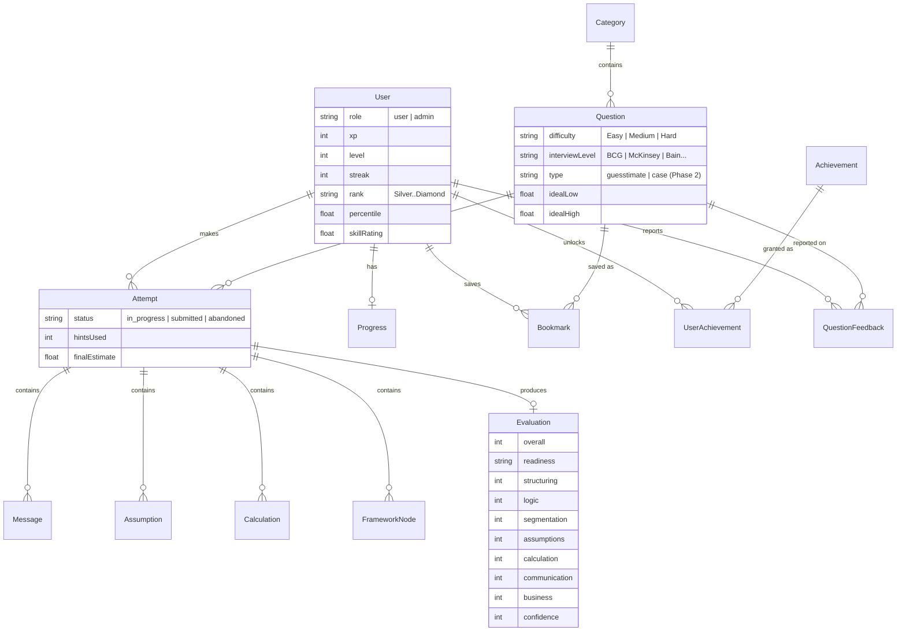
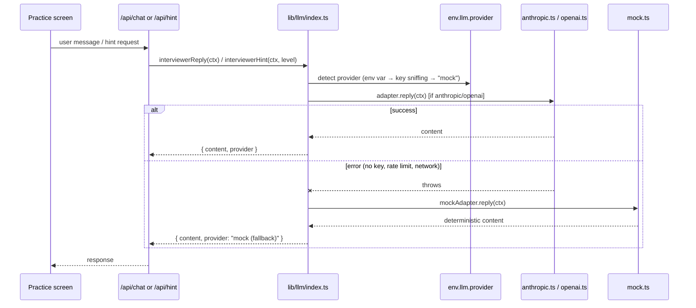
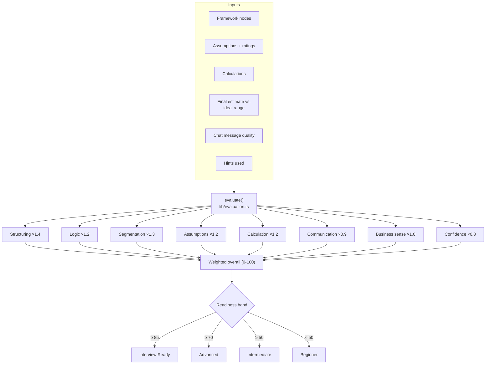
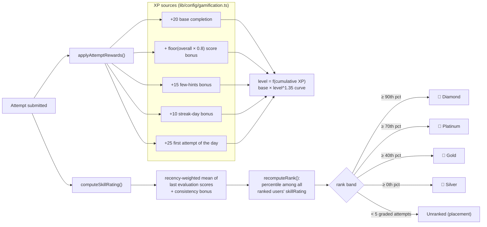
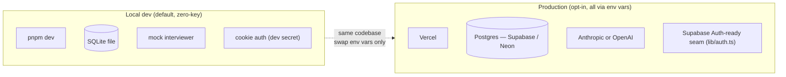

# EstimateIQ — Architecture & Documentation

EstimateIQ is a **local-first, zero-key** Next.js app that lets MBA / consulting / PM
candidates practise India-focused market-sizing guesstimates against an AI interviewer,
then get a scored evaluation and gamified progress (XP, levels, streaks, percentile rank).

This document is the visual companion to the root [`README.md`](../README.md): it covers
system architecture, the request/data flow, the data model, and the scoring & gamification
rules, each with a diagram.

---

## 1. System architecture

Next.js 15 App Router serves both the UI (React Server Components) and the backend
(Server Actions + a few Route Handlers) from one deployable unit. Prisma is the only way
any code touches the database.



**Key principle:** every external dependency (LLM, database, auth provider) sits behind a
narrow interface in `lib/`, so the app runs fully offline by default and upgrades to real
services purely through environment variables (see root README, "Enabling a real LLM").

---

## 2. End-to-end user flow

A guest can complete the entire core loop — practice → evaluation — with zero signup.
Signing up "claims" the guest's history in place.



---

## 3. Data model (Prisma / SQLite → Postgres)



---

## 4. LLM interviewer: pluggable adapter with safe fallback



The mock adapter is deliberately **deterministic and rule-based** (never reveals the
answer early), so `pnpm test` can assert interviewer behavior without any network calls.

---

## 5. Evaluation rubric

Every submitted attempt is scored across 8 weighted categories (`lib/config/evaluation.ts`),
producing an overall score and a readiness band.



---

## 6. Gamification & percentile rank

XP/levels reward *activity*; rank rewards *quality* — they are deliberately decoupled.



---

## 7. Directory guide

```
app/
├── actions/          Server Actions — the app's real "API" (auth, practice, submit, admin, user)
├── api/               Route Handlers for streaming/chat-style endpoints (chat, hint, feedback, admin import)
├── admin/             Admin panel (question/category CRUD, import, feedback queue)
├── dashboard/         Stats, charts, rank card, achievements
├── library/           Browse/filter questions
├── practice/[id]/     Core interviewer + calculator + framework + evaluation UI
└── (login|signup|forgot-password)/   Auth pages

components/
├── ui/                shadcn-style primitives (button, card, dialog, tabs, ...)
├── practice/           Chat panel, calculator, framework builder, tools panel, evaluation report
├── dashboard/          Charts (Recharts), stat cards, rank card, achievements
├── admin/              Question/category managers, CSV/JSON import, feedback queue
└── marketing/          Landing page sections

lib/
├── config/            Central typed config: env, flags, evaluation weights, gamification curve, practice defaults
├── llm/                Pluggable interviewer adapters (mock / anthropic / openai) + prompt builder
├── auth.ts             Signed cookie sessions, guest mode, claim-on-signup
├── evaluation.ts       Rubric scorer (pure, unit-tested)
├── gamification.ts     XP/level/streak/rank rules (pure, unit-tested)
├── calc.ts             Calculator expression engine (pure, unit-tested)
├── progress.ts         Per-user rollups (totals, accuracy, by-category/by-skill)
└── questions.ts / db.ts  Content access, Prisma client singleton

prisma/
├── schema.prisma       Data model (see ERD above)
└── seed-data.ts / seed.ts   14 categories, 24 India-only questions, achievements, demo users
```

---

## 8. Deployment topology



---

*Diagrams are [Mermaid](https://mermaid.js.org/) and render natively on GitHub. For deep
dives on any single subsystem (evaluation rubric weights, XP curve, rank bands), see the
config files under `lib/config/`, which are intentionally the single source of truth.*
