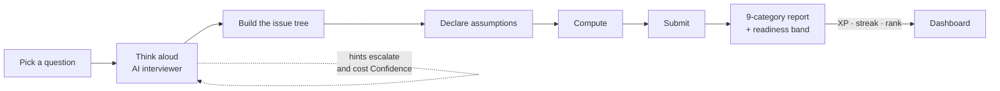

# CASE CLOSED — Pitch Deck Kit

Everything needed to build the deck: a slide-by-slide spec (headline, body, visual, speaker
notes), a visual system, and copy-paste **prompts** — one master prompt that generates the
whole deck in an AI deck tool, plus a per-slide prompt for the visual on that slide.

For the system being pitched see [`ARCHITECTURE.md`](./ARCHITECTURE.md); for the retention
strategy behind slides 13–14, [`RETENTION.md`](./RETENTION.md); for what shipped,
[`CHANGES.md`](./CHANGES.md).

---

## Read this before you present

**Everything in `[SQUARE BRACKETS]` is a number you do not have yet.** The product is
pre-launch: no public users, no revenue, no payment gateway. A deck that invents a retention
curve is a deck that dies in diligence, and this one is deliberately built so the honest
version is still strong — the traction slide (12) pitches *engineering evidence*, and the
market slide (10) is a bottom-up frame you fill from sources you cite, not a headline TAM
lifted from a blog.

Two claims are load-bearing and both are true today, so lean on them:

- **It runs with zero keys and zero external services** — SQLite, dev auth, a deterministic
  offline interviewer. A demo cannot fail because an API is down or a card expired.
- **The simulation engine is deterministic and self-checking** — `checkBalance` brute-forces
  every affordable combination of interventions to prove the declared best play really is
  best. Content cannot silently teach the wrong lesson.

### Three audiences, three cuts

The deck below is the **investor/seed** cut. Two variants reuse the same slides:

| Audience | Slides to use | What changes |
|---|---|---|
| **Investor / seed** | All 16 | Lead with problem (2) → insight (4) → war room (7). Ask on 16. |
| **B2B — a college or a placement cell** | 1, 2, 3, 5, 6, 7, 8, 11, 13, 16 | Replace the market slide with *cohort outcomes*; the ask becomes a pilot with one batch. |
| **Portfolio / jury / hiring panel** | 1, 2, 4, 5, 7, 8, **9**, 12, 15 | Slide 9 (architecture) moves to position 4 and gets 3 minutes; the ask becomes "here's the repo". |

Timing for the full 16: **12–14 minutes**, roughly 45 seconds a slide with 2 minutes held for
the live war-room demo on slide 7.

---

## The visual system

Set this once in the deck tool and every slide inherits it. It matches the app, so a screenshot
never looks pasted in from somewhere else.

| Token | Value | Used for |
|---|---|---|
| Ink | `#0B1220` | Headlines, dark slide backgrounds |
| Paper | `#FFFFFF` / `#F6F8FB` | Slide background, card fills |
| Primary | `#2563EB` | The one accent — CTAs, the active bar in a chart, the highlighted node |
| Success | `#16A34A` | "works today", positive deltas |
| Warn | `#F59E0B` | "in progress", the honest-limitation slides |
| Danger | `#DC2626` | The problem slides, negative deltas |
| Muted | `#64748B` | Labels, axis text, footnotes |

**Type:** Inter (or Söhne / General Sans). Headline 40–48pt bold, subhead 20–24pt regular,
body 16–18pt, footnote 12pt in Muted. **Never more than 6 lines of body text on a slide.**

**Rules that keep it looking like one deck:**
- One idea per slide; the headline states the idea as a *sentence*, not a label
  ("Candidates run out of feedback, not questions" beats "Problem").
- Every chart uses Primary for the series that matters and Muted grey for everything else.
- Screenshots sit in a rounded 12px frame with a soft shadow, never full-bleed and never tilted.
- ₹ and Indian numbering (lakh/crore) throughout — the product is India-first and the deck
  should sound like it.
- Footnote every external number with its source and date, right on the slide.

---

## Master prompt — generates the whole deck

Paste into Gamma, Tome, Beautiful.ai, Copilot in PowerPoint, Claude, or ChatGPT. Fill the
bracketed values first.

```text
You are a presentation designer building a 16-slide seed-stage pitch deck for a pre-launch
edtech product. Produce one slide per section below, in order.

PRODUCT
CASE CLOSED — "Duolingo for consulting and PM interviews." A web app where MBA, consulting
and product-management candidates in India practise three things: market-sizing
guesstimates, business cases, and decision simulations ("war rooms"). An AI interviewer
runs the first two with Socratic questioning and escalating hints that never reveal the
answer, then scores the attempt against a 9-category rubric. The third is played against a
deterministic causal model that answers with moved business metrics — orders, retention,
margin — instead of a mark.

STATUS: pre-launch. No public users, no revenue, no payment gateway. Built and tested end
to end: ~55,000 lines of TypeScript, 50 test suites, 12 product surfaces, 45 seeded
exercises (24 guesstimates, 2 cases, 20 simulations). Runs fully offline with zero API
keys; real LLM providers swap in through environment variables only.

AUDIENCE: seed investors in India edtech. Tone: precise, evidence-first, no hype. Every
claim is either demonstrable in the product today or explicitly labelled as planned.

DESIGN
Palette: ink #0B1220, paper #FFFFFF, primary accent #2563EB, success #16A34A, warning
#F59E0B, danger #DC2626, muted #64748B. Font: Inter. Generous whitespace, one idea per
slide, headlines written as full sentences. Maximum 6 lines of body text per slide. Indian
currency and numbering (₹, lakh, crore). Each slide needs a distinct visual — a diagram,
chart, comparison table or product screenshot placeholder — never a wall of bullets.

SLIDES
1. Title — "Crack case interviews with an AI interviewer, not an answer key." Product name,
   one-line positioning, presenter, date.
2. Problem — Interview prep in India is a content library plus a mirror. Candidates get
   questions and answer keys, but nobody watches them think, so the thing being graded in a
   real interview is the only thing never practised. Peer mocks are unreliable and don't
   scale; a coach is ₹[COACH_HOURLY]/hour.
3. Why today's options miss — a comparison table across: casebooks/PDFs, peer mock groups,
   paid coaches, generic AI chat, CASE CLOSED. Columns: gives feedback on reasoning,
   available on demand, India-specific content, consistent scoring, cost.
4. The insight — an interview is not a quiz. It is a conversation about how you think,
   ending in a defensible number or a defensible recommendation. So the product grades the
   path, not the answer, and refuses to hand over the answer early.
5. The solution — three exercise formats on one engine: guesstimate (ends in a number,
   scored against an authored ideal range), case (ends in a recommendation, scored on
   whether the issue tree localised the true root cause), war room (played, not answered).
6. How practice works — the loop: pick a question → think aloud with the AI interviewer →
   build an issue tree on a canvas → declare assumptions → compute in the built-in
   calculator → submit → a 9-category scored report with a readiness band. Hints escalate
   and cost Confidence; the mode that works the problem for you is priced like the whole
   hint ladder and disclosed in the report.
7. The war room (the differentiator) — read a dashboard, commit to a hypothesis before
   spending anything, buy data pulls from a budget of analyst-days, name a root cause (it
   locks), split a quarter of engineering capacity and rupees across fixes, then watch the
   quarter play out as moved metrics. You spend only against the cause you named.
8. Why it is hard to copy — the outcomes come from an authored directed graph of business
   drivers, not from a language model. Deterministic, auditable, replayable. A balance
   checker brute-forces every affordable combination of moves to prove the declared best
   play is genuinely best, so a scenario cannot ship teaching the wrong lesson. Answers stay
   server-side until earned.
9. Architecture — Next.js 15, React 19, TypeScript strict, Prisma. Every external dependency
   (model provider, database, auth, storage, speech) sits behind a narrow adapter, so the
   product runs offline by default and upgrades through environment variables. Spend guards
   degrade to the offline interviewer instead of erroring mid-session.
10. Market — bottom-up, India first: [MBA_ASPIRANTS] candidates a year sitting entrance
    exams, [B_SCHOOL_SEATS] seats, of whom [CONSULT_PM_SHARE]% target consulting or product
    roles, at ₹[ARPU]/year → serviceable market of ₹[SAM_CRORE] crore. Label every figure
    with its source and date.
11. Business model — free forever tier (the whole loop, no card), Pro at ₹499/month for the
    full library. Pro is built as a dated pass, not a subscription: one timestamp on the
    user, so there is no renewal job and no cancellation flow. B2B licensing to placement
    cells is the second line.
12. Where we are today — engineering evidence, not vanity metrics. 45 exercises, 12
    surfaces, 50 test suites, deterministic scoring, entitlements and gating complete and
    tested ahead of any payment integration. Explicitly: zero public users, pre-launch.
13. What we build next — four retention levers, in order: instrumentation, mastery instead
    of a checklist, a dated daily loop, and weekly college leagues. Content volume is
    deliberately last, because a motivated user always consumes faster than one person
    authors.
14. Goals — a two-column slide. Now (next 90 days): instrument, ship mastery, private beta
    with [BETA_N] candidates, first paid pass. Later (12 months): [MAU] monthly actives,
    [PAYING] paying, [COLLEGES] campus partnerships, 30+ war rooms.
15. Risks, stated plainly — model cost per session, content exhaustion, cold-start on
    leaderboards, seasonality around placement cycles. Show the mitigation already built for
    each.
16. The ask — [ASK_AMOUNT] for [RUNWAY] months, allocated across content, distribution and
    infrastructure, to reach [MILESTONE]. Contact details.

Return each slide as: HEADLINE, SUBHEAD, 3-5 body points, a VISUAL description, and 40 words
of speaker notes.
```

---

# Slide-by-slide specification

Each slide gives you: **purpose** (why it exists in the argument), **headline** (use verbatim
or edit), **body** (what goes on the slide), **visual** (exactly what to draw), **notes**
(what you say), and **prompt** (paste into an image or diagram tool for that one visual).

---

## Slide 1 — Title

**Purpose.** Land the positioning in one breath. The audience should be able to repeat your
one-liner to a colleague after the meeting.

**Headline.** Crack case interviews with an AI interviewer, not an answer key.

**Subhead.** CASE CLOSED — India-focused guesstimates, business cases and decision simulations
for MBA, consulting and PM candidates.

**Body.** Presenter name · date · one contact line. Nothing else.

**Visual.** Dark ink background. Product wordmark centred. Behind it, at 20% opacity, a
single screenshot of the practice screen with the chat panel and the issue-tree canvas both
visible — the whole product in one image. A `Zero API keys · Runs offline` chip in Muted at
the bottom.

**Notes.** "Every candidate has access to a thousand practice questions and to nobody who
will listen to them answer one. We built the listener."

**Prompt.**
```text
A minimal dark title slide, background #0B1220. Centred white wordmark "CASE CLOSED" in Inter
Bold, and beneath it in #64748B: "Duolingo for consulting and PM interviews". Behind the text,
at 20% opacity, a wide screenshot of a two-panel web app — a chat conversation on the left, a
node-and-branch tree diagram on the right. A thin #2563EB underline accent below the wordmark.
Generous margins, no other elements, 16:9.
```

---

## Slide 2 — The problem

**Purpose.** Name the gap in a way the audience recognises from their own life. Do not
describe the market yet.

**Headline.** Candidates run out of feedback long before they run out of questions.

**Body.**
- Case interviews grade **how you think** — structure, assumptions, arithmetic under
  pressure, the recommendation you can defend.
- What prep actually offers: a PDF of questions and an answer key at the back. The answer key
  can't tell you your tree was wrong.
- Peer mocks depend on a peer who is free, prepared and honest. Two of the three usually fail.
- A coach who *can* do it costs ₹`[COACH_HOURLY]` an hour and isn't available at 1 a.m. the
  night before a shortlist.
- So the one skill being tested is the one thing never rehearsed with feedback.

**Visual.** A three-panel "what exists today" strip, each panel with an icon and one
consequence line in Danger red: *Casebook → no feedback*, *Peer mock → inconsistent, hard to
schedule*, *Coach → ₹₹₹, not on demand*. A fourth panel outlined in Primary and left blank
with a "?" — the space the product will fill on slide 5.

**Notes.** "Ask anyone who's prepped for a consulting interview what their weakest area is.
They can name the topic. They cannot tell you what they do wrong inside it — because nobody
has ever told them."

**Prompt.**
```text
A clean light presentation slide, background #F6F8FB. Four equal cards in a row with rounded
corners and soft shadows. Cards 1-3 each hold a simple line icon (a closed book, two speech
bubbles, a person at a desk) with a short label beneath and a small red #DC2626 cross badge in
the corner. Card 4 is empty with a dashed #2563EB border and a large muted question mark.
Flat vector style, Inter typography, lots of whitespace, 16:9.
```

---

## Slide 3 — Why today's options miss

**Purpose.** Pre-empt "isn't this just ChatGPT?" before anyone asks it out loud. This is the
slide that earns the right to the rest of the deck.

**Headline.** Every option gives you questions. None of them watch you answer.

**Body.** A comparison table — five rows, five columns:

| | Casebook / PDF | Peer mock | Paid coach | Generic AI chat | **CASE CLOSED** |
|---|---|---|---|---|---|
| Feedback on your *reasoning* | ✗ | ~ | ✓ | ~ | **✓** |
| Available on demand | ✓ | ✗ | ✗ | ✓ | **✓** |
| India-specific content | ~ | ~ | ~ | ✗ | **✓** |
| Consistent, comparable scoring | ✗ | ✗ | ~ | ✗ | **✓** |
| Refuses to hand you the answer | ✓ | ~ | ✓ | ✗ | **✓** |
| Cost | Low | Free | ₹`[COACH_HOURLY]`/hr | Low | **₹0–499** |

**Say the honest part out loud:** a general chat assistant *will* answer a guesstimate. That
is precisely the failure — it solves it for you, praises the answer, and scores nothing. Our
prompts are built around never revealing the answer early, and that behaviour is pinned by a
test.

**Visual.** The table, with the CASE CLOSED column filled Primary at 8% tint and its header in
Primary bold. Ticks in Success, crosses in Muted (not red — you're not attacking alternatives,
you're locating yourself).

**Notes.** "The interesting column isn't ours, it's the last row of the AI column. A chat
assistant is optimised to be helpful, which in an interview rehearsal is exactly the wrong
instinct. We spend real effort making the model *withhold*."

**Prompt.**
```text
A comparison matrix slide, white background. Five columns and six rows, thin #E2E8F0 grid
lines, no heavy borders. The rightmost column is tinted #2563EB at 8% opacity with a bold blue
header. Cells contain small green #16A34A check marks, muted grey crosses, or short text.
Inter typography, generous cell padding, flat and editorial, 16:9.
```

---

## Slide 4 — The insight

**Purpose.** The turn. One sentence the audience remembers for the rest of the meeting.

**Headline.** An interview is not a quiz. It's a conversation about how you think.

**Body.**
- The output of a case is a *defensible* number or a *defensible* recommendation — the
  defence is the product.
- So grade the **path**, not the destination: structure, segmentation, assumptions,
  arithmetic, diagnosis, communication, business sense, confidence.
- And withhold the answer. A hint ladder that escalates, priced in Confidence, and disclosed
  in the report — because help that isn't recorded corrupts the score.
- One consequence worth stating: a candidate can end up **near the right number with a wrong
  tree**, and the report will say so. That's the whole point.

**Visual.** Two side-by-side paths from the same question to the same number. The left path
is a straight grey arrow labelled "answer key: correct". The right path is a branching tree
where each node carries a small score chip, labelled "the thing an interviewer actually
grades". Same endpoint, wildly different information.

**Notes.** "Two candidates say 'about 40 lakh cups a day'. One segmented by city tier and
daily frequency; one guessed. The answer key can't tell them apart. An interviewer can, and
that difference decides who gets the offer."

**Prompt.**
```text
A concept diagram slide, white background. Left half: a single straight grey arrow from a
question mark icon to a number, labelled "the answer". Right half: a branching tree from the
same question mark, four levels deep, nodes in #2563EB with small score chips attached,
converging on the same number, labelled "the reasoning". A thin vertical divider between the
halves. Minimal flat vector, Inter labels, plenty of whitespace, 16:9.
```

---

## Slide 5 — The solution

**Purpose.** Show the product's shape. Three formats, one engine.

**Headline.** Three ways to be wrong in front of something that will tell you.

**Body.**
- **Guesstimate** — ends in a number, scored against an authored ideal range. *25 today.*
- **Case** — ends in a recommendation, scored on whether your issue tree localised the true
  root cause. *2 today.*
- **War room / simulator** — not answered, **played**: diagnose, allocate, live with the
  consequences. *14 today.*
- All India-context: cities, ₹, real market structures — because "two lakh" is not "two
  hundred thousand" in an Indian interview room, and a US-benchmarked answer is a wrong answer.
- Free to try with **no login**: one of each format is open to a guest, replayable without
  limit.

**Visual.** Three cards, each with a format icon, a one-line definition, a real example title
(*"Cups of chai sold in Bangalore daily"*, *"Food-delivery margin"*, *"Kadak Coffee: ROAS 4.0
and losing money"*), and a count badge. Below them, a single bar labelled "one evaluation
engine, one progress system" spanning all three.

**Notes.** "A guesstimate teaches you to build a number you can defend. A case teaches you to
find the problem. A war room teaches you what happens after you decide — which is the part no
casebook has ever been able to show anyone."

**Prompt.**
```text
Three feature cards in a row on a white slide, rounded corners, soft shadows. Each card has a
line icon at the top (a calculator, a branching tree, a control dashboard), a bold short
title, two lines of body text, and a small blue count badge in the top-right corner. Beneath
all three, one full-width slim bar in #2563EB with white centred text. Flat vector, Inter,
16:9.
```

---

## Slide 6 — How practice works

**Purpose.** Make the core loop concrete. This is where the product stops being an idea.

**Headline.** Think aloud, build the tree, defend the assumptions — then get graded on all
three.

**Body.** The loop, left to right: **pick → converse → structure → assume → compute →
submit → report**.
- The interviewer asks Socratic questions and pushes back; hints escalate and never open with
  the answer.
- The issue tree is built on a canvas, and it's *scored* — not decoration.
- The report is 9 categories with a readiness band: **Beginner → Intermediate → Advanced →
  Interview Ready** at 85.
- A category that never applied to an attempt scores **null, not zero** — a guesstimate isn't
  marked down for having no diagnosis to do.
- Help is priced. Escalating hints cost Confidence; the mode that works the problem for you
  costs the equivalent of the whole ladder and is disclosed in the report.

**Visual.** A horizontal 7-step flow with a real screenshot beneath the step it belongs to
(chat panel under "converse", tree canvas under "structure", the radar report under "report").
Use the app's own radar chart — it is the single most convincing image in the product.

**Notes.** "Two things people miss on this screen. The tree is graded, not decoration. And the
hints cost you something — because a scoring system that doesn't know how much help you took
is measuring the help."

**Prompt.**
```text
A horizontal seven-step process flow across the top third of a white slide: rounded pill
nodes connected by thin #2563EB arrows, each pill with a small icon and a one-word label.
Below, three screenshot placeholder frames of unequal width with rounded corners and soft
shadows, connected up to steps 2, 3 and 7 by thin dotted grey lines. Editorial layout, Inter,
16:9.
```

**Reusable diagram (mermaid) — drop straight into the deck if you'd rather not screenshot:**



---

## Slide 7 — The war room

**Purpose.** The differentiator. Spend the most time here; if you demo anything live, demo
this. This is the slide investors will remember.

**Headline.** The only format that makes you live with your decision.

**Body.** Four phases, and the constraint in each:
1. **Observe** — read the dashboard, commit to a hypothesis *before* spending anything.
2. **Investigate** — buy data pulls from a fixed budget of analyst-days. Cheap and early
   beats exhaustive.
3. **Diagnose** — name the root cause. **It locks.** From that point the board shows only the
   fixes that treat *your* cause.
4. **Allocate** — split a quarter of engineering capacity and rupees across those fixes.
- Then the quarter plays forward and reports **moved metrics — orders, retention, margin —
  rather than a mark.** The debrief reveals the true causal chain and compares your allocation
  against the best available one.
- Sometimes the answer is that nothing can be fixed — a monsoon, a competitor's launch — and
  **holding the capacity is the correct play.**

**Visual.** A four-phase horizontal timeline with a budget meter draining across it, ending in
a debrief card showing three metric deltas (one green, one red, one flat) beside a small
"true causal chain" tree. Label the lock icon on phase 3 explicitly — that constraint is the
insight.

**Notes.** "Naming the cause locks it, and then you can only fund fixes that treat *that*
cause. Before we did that, you could diagnose the wrong branch, fund the right fix anyway, and
score full marks. That's not how a decision works anywhere else, so it isn't how it works
here."

**Prompt.**
```text
A four-phase horizontal timeline on a white slide. Four numbered circular nodes in #2563EB
connected by a thick line, labelled Observe, Investigate, Diagnose, Allocate. A slim
horizontal budget meter runs beneath the timeline, filled and draining left to right from
green #16A34A to amber #F59E0B. A small padlock icon sits on the third node. At the right
end, a rounded results card showing three metric rows with up, down and flat arrows in green,
red and grey. Flat vector, clean, Inter, 16:9.
```

**Scenario table — use as a backup or appendix slide.** Twenty ship today, easiest first:

| Scenario | Level | Teaches |
|---|---|---|
| Kadak Coffee — ROAS 4.0 and losing money | Easy | Why a campaign only breaks even once ROAS clears 1 ÷ gross margin |
| Rangoli — the test says +6%, ship it Monday? | Easy | Significance, novelty effect, reading a test on the metric that pays |
| Sahyog Finance — the best agency got 60% of the book, recovery fell | Easy | Between- vs within-group spread; a league table can be a mix table in disguise |
| Chalo Fitness — fourteen ways to read one test, one said yes | Easy | Multiple comparisons, optional stopping, power; "not significant" is not "no effect" |
| Kavach Pay — 99.4% accurate, and payment success is falling | Easy | Confusion matrix, class imbalance, precision vs recall, threshold as a cost decision, calibration |
| Vyapar Mitra — 38% more signups, the same 11,000 shops | Easy | Activation vs acquisition; a bottleneck caps output however much arrives |
| Padhai Plus — growing subscribers, growing burn | Easy | LTV, CAC, payback; a base settles at joiners ÷ churn |
| Chaska — share up five points, profit down a third | Easy | Why market share is a diagnostic, not a target |
| Kirti Apparel — revenue +22%, profit −62% | Easy | Reading a P&L; a consolidated statement is an average until you split it |
| Nirmal Pipes — record profit, no money for payroll | Easy | Working capital and the cash conversion cycle |
| Deccan Ceramics — record EBITDA, the bank wants a word | Medium | Leverage, interest cover, ROCE, the DuPont split |
| Suraksha Home — match the competitor's price cut? | Medium | Contribution, break-even volume on a price change, elasticity |
| Ujala Solar — planned 10.8 lakh, sold 4.3 lakh | Medium | TAM/SAM/SOM and channel economics on net revenue |
| Ghar Sewa — both sides grew, both sides are angry | Medium | Liquidity, match rate, take rate; averages hide the markets that matter |
| Sehat Plus — 87% availability on 24% more stock | Medium | Fill rate, safety stock, CV; one service level across unlike items is an average |
| Setu — shipped the roadmap, retention fell | Medium | Value at risk over request volume; a demand signal can be precise and unrepresentative |
| Lekha — our best customer wants 18% off | Medium | ARR, cost to serve, NRR, TCO from both sides of the table |
| NukkadEats — orders down 9%, nobody knows why | Medium | Diagnosis with the model hidden — the hardest one |
| Cash-runway turnaround | Medium | Sequenced decisions when the diagnosis is already done |
| Buyback contract — 12 months, one supplier watching | Medium | A buyback clause is a relationship, not a term sheet |

---

## Slide 8 — Why this is hard to copy

**Purpose.** Answer the moat question with something structural rather than aspirational.

**Headline.** The outcomes come from a causal model, not from a language model.

**Body.**
- Every war room is an authored **directed graph of business drivers**. Only input drivers
  move; the rest are derived — so a scenario physically cannot claim a cost fell and a margin
  that didn't move.
- **Deterministic and pinned.** Effects compose multiplicatively, so allocation *order* can't
  change the result, and a result is frozen at commit — retuning content later cannot rewrite
  someone's past report.
- **Balance is proven, not asserted.** A checker brute-forces every affordable combination of
  interventions to confirm the declared best play really is the best. A scenario that fails is
  a broken scenario, not a new one.
- **The answer is server-side until it's earned.** The client payload is assembled field by
  field, so a new field is *absent* until someone deliberately exposes it — and a test asserts
  against the serialised payload.
- Consequence: **content is cheap to add and impossible to fake.** A new scenario is a file, a
  registry line and a seed row — with a proof obligation attached.

**Visual.** A driver DAG: input nodes on the left in Primary (the levers a candidate can
move), derived nodes cascading right in grey, one reported metric highlighted at the far
right. Overlay a small "✓ balance-checked · 2ⁿ combinations" badge.

**Notes.** "If a language model generated the outcomes, a scenario would be a different
lesson every time you played it and no two candidates could be compared. Ours is arithmetic
we authored. The model's job is to converse and to coach — never to decide what happened."

**Prompt.**
```text
A directed acyclic graph diagram on a white slide, flowing left to right. Three input nodes
on the left as filled #2563EB rounded rectangles labelled as levers; six derived nodes in the
middle as grey outlined rounded rectangles; one large highlighted outcome node on the right
with a #16A34A border. Thin arrows with small arrowheads connect them, some fanning in. A
small verification badge with a check mark sits in the lower right. Clean technical diagram
style, Inter, 16:9.
```

---

## Slide 9 — Architecture

**Purpose.** Engineering credibility. **Skip it for a generalist investor; expand it to three
minutes for a technical audience or a hiring panel.**

**Headline.** Every external dependency sits behind an adapter — so the product runs with no
keys at all.

**Body.**
- Next.js 15 App Router · React 19 · TypeScript strict · Prisma · Tailwind. One deployable
  unit; Prisma is the only path to the database.
- Model provider, database, auth, avatar storage and speech each sit behind a narrow
  interface. **Swapping any of them is a config change, not a code change.**
- Default is a deterministic offline interviewer — so a demo never depends on a network, and
  the test suite exercises real behaviour rather than a mock's fiction.
- **Two spend guards**: a per-user hourly cap and a deployment-wide daily cap. Exceeding
  either degrades to the offline interviewer, badged in the chat, instead of erroring
  mid-session. Same on a rate limit or an outage.
- SQLite in development → Postgres/Supabase in production behind one environment variable.

**Visual.** The layered architecture diagram — client, framework, domain, adapters, providers,
data — with the adapter row highlighted in Primary and dotted fallback arrows from each
provider back to the offline mock.

**Notes.** "The reason this matters commercially: our cost per session is a dial, not a
constant. If model spend runs hot, the product degrades to something still usable rather than
to an error page. Very few AI products can say that."

**Prompt.**
```text
A layered system architecture diagram, white background, six stacked horizontal bands
labelled Browser, Next.js App Router, Domain logic, Adapters, Providers, Data. Each band holds
2-5 rounded rectangles. The Adapters band is filled #2563EB with white text; all other bands
are light grey with dark text. Thin solid arrows flow downward between bands, and dotted
arrows curve from the Providers band back to one highlighted "offline mock" box. Technical,
clean, Inter, 16:9.
```

---

## Slide 10 — Market

**Purpose.** Show the opportunity is big enough, built bottom-up so it survives a follow-up
question.

**Headline.** Every placement season, `[MBA_ASPIRANTS]` candidates prepare for the same
interview.

**Body.** Build it in four steps on the slide, each with a source footnote:
1. Candidates sitting Indian management entrance exams each year → `[MBA_ASPIRANTS]`
2. × share targeting consulting, product or strategy roles → `[CONSULT_PM_SHARE]`%
3. × realistic willingness to pay for prep, at ₹`[ARPU]`/year
4. = serviceable market of ₹`[SAM_CRORE]` crore/year — before B2B licensing to placement
   cells, and before the adjacent segments (engineering-campus PM aspirants, early-career
   switchers, the finance track).

**Wedge, stated plainly:** start with consulting and PM aspirants at top Indian B-schools —
concentrated, reachable through ~60 institutions already enumerated in the product, and
loud when something works.

**Do not** put a global TAM on this slide. A bottom-up number you can defend beats a large
number you cannot.

**Visual.** A funnel narrowing across four stages with the value at each, and beside it a
small "who they are" panel: three candidate personas with one line each (final-year MBA
targeting MBB · engineer switching to PM · early-career consultant prepping for a lateral).

**Notes.** "We're not going after everyone preparing for anything. The wedge is consulting
and PM aspirants at Indian B-schools, because they're concentrated, they self-organise into
prep groups, and they talk to each other constantly — which is our distribution."

**Prompt.**
```text
A four-stage funnel diagram on the left two-thirds of a white slide, narrowing downward, each
band a different tint of #2563EB from light to saturated, each with a large number and a short
label to its right. On the right third, three stacked persona cards with a small circular
avatar placeholder and one line of text each. Small footnote line in #64748B at the bottom.
Flat vector, Inter, 16:9.
```

---

## Slide 11 — Business model

**Purpose.** Show you've thought about money, and that the mechanics are already built.

**Headline.** Free forever for the whole loop. ₹499/month for the whole library.

**Body.**
- **Guest** — no account: one guesstimate, one case, one war room, replayable without limit.
  No card, no login.
- **Free account** — the same content, plus saved progress, streaks, a percentile rank and a
  profile.
- **Pro, ₹499/month** — the full library: 24 guesstimates, both cases, all 20 war rooms.
- **The mechanic is a dated pass, not a subscription.** Pro is one timestamp on the user row,
  compared against *now* — so there is no renewal job, no cron, no cancellation flow, and no
  stored label that can drift out of date. Granting extends rather than resets.
- **Second line: B2B.** Placement cells and prep institutes license cohort access; the
  admin panel already grants and revokes passes.
- **Status:** entitlements, gating and the pass are complete and tested. **No payment gateway
  is wired up yet** — that is a signature check and a webhook calling the grant function that
  already exists.

**Visual.** Three pricing cards (Guest / Free / Pro) with Pro highlighted, and beneath them a
small timeline graphic showing a pass being extended rather than reset — the detail that
signals real product thinking.

**Notes.** "We deliberately built the entitlement half before the money half. Every gate, every
locked card and every server check reads one function, so adding a gateway moves nothing else.
It also means the app stays demo-able with zero keys."

**Prompt.**
```text
Three pricing cards in a row on a white slide, rounded corners. The middle card is elevated
with a #2563EB border and a small "Planned" chip. Each card has a tier name, a large price, and
four short feature lines with green check marks. Below the cards, a slim horizontal timeline
showing two overlapping bars where a second bar extends the first rather than replacing it,
with a small caption. Flat, clean, Inter, 16:9.
```

---

## Slide 12 — Where we are today

**Purpose.** Establish credibility without inventing traction. **Honesty here is a feature —
say the pre-launch part before anyone has to ask.**

**Headline.** Pre-launch, and built end to end.

**Body.** What exists, verifiable in the repository today:
- **46 exercises** — 24 guesstimates, 2 cases, 20 war rooms, all India-context.
- **12 product surfaces** — landing, library, practice, war rooms, dashboard, profile,
  onboarding, admin, auth.
- **~55,000 lines** of strict TypeScript across **50 test suites** — scorer, gamification,
  entitlements, billing arithmetic, the LLM adapters and streaming protocol, the simulation
  engine, and the balance proof for every authored scenario.
- **Runs offline, zero keys.** Anyone can clone it and have the whole product in three
  commands.
- Content is retunable from the admin panel without a deploy, and every edit is re-validated
  for shape, structure and balance before it is allowed to save.

**And what does not exist:** public users, revenue, a payment gateway, email. State it on the
slide in Warn amber. You will be asked; answering first is worth more than the slide costs.

**Visual.** Four large stat tiles across the top (40 · 12 · 50 · 0 keys), and below them a
two-column "Shipped / Not yet" list with Success ticks and Warn dashes.

**Notes.** "There are no usage numbers because there are no users yet — that's the next
ninety days. What I can show you is that the hard half is done: the scoring, the entitlements
and the simulation engine are built and tested before a rupee has moved."

**Prompt.**
```text
A metrics slide, white background. Top half: four large stat tiles in a row, each with a very
large number in #0B1220 and a small #64748B caption beneath. Bottom half: two columns headed
"Shipped" and "Not yet", the left with green #16A34A check marks, the right with amber #F59E0B
dashes, four short items each, separated by a thin vertical rule. Clean, editorial, Inter, 16:9.
```

---

## Slide 13 — What we build next

**Purpose.** Show the roadmap is a thesis, not a wish list. This slide is where a good
investor decides whether you think clearly.

**Headline.** The retention problem isn't 40 questions. It's that we measure progress as
content consumed.

**Body.**
- A motivated candidate exhausts any library in a fortnight, and **the rate a user consumes
  content will always beat the rate one team authors it.** So more content cannot be the
  answer.
- Four levers, in build order — **none of the first three needs new content**:
  1. **Instrumentation** — a no-op analytics adapter by default, real behind a key. Four
     metrics: D1/D7/D30, sessions per active week, attempts before last session, content
     exhaustion rate.
  2. **Mastery instead of a checklist** — track mastery per question, invert the recommender
     so "not yet attempted" is a *ranking term* rather than a hard filter, and surface replay
     as progress. Today a candidate who scored 41 on structuring is never shown that question
     again — the recommender actively steers people away from their weaknesses.
  3. **A dated daily loop** — one deterministic daily question everyone gets, a weekly cycle,
     and a sink for the coins already being minted and spent on nothing.
  4. **Weekly college leagues** — the schema is already laid for it, gated on having enough
     real users per college, because a leaderboard shipped empty advertises that nobody's here.
- **The rule that keeps it honest:** mastery may count replays; percentile rank must not. A
  warm retry is easier, so grinding a remembered question moves practice evidence without
  moving skill evidence.

**Visual.** A 2×2 or a four-step ladder, each lever with an "engineering cost / expected
effect" chip, and a small dependency arrow showing instrumentation gating everything after it.

**Notes.** "The honest caveat is on this slide too: one of those four metrics can invalidate
the plan. If people stop after one to three attempts, the problem is activation, not
retention, and levers 2 to 4 are the wrong work. That's why instrumentation ships first."

**Prompt.**
```text
A four-step ascending ladder or staircase diagram on a white slide, left to right, each step a
rounded rectangle in progressively more saturated #2563EB, numbered 1-4 with a short bold
label and one line of body text. A thin dotted arrow loops from step 1 back beneath steps 2-4
labelled "gates everything after it". Small cost/effect chips on each step. Flat vector,
Inter, 16:9.
```

---

## Slide 14 — Goals and objectives

**Purpose.** Turn the roadmap into commitments with numbers attached. Fill every bracket
before you present — a goals slide with placeholders reads as a product with no plan.

**Headline.** What we're proving in 90 days, and what it becomes in 12 months.

**Body.** Two columns.

**Now — next 90 days (prove the loop works):**
- Ship instrumentation and mastery before any launch, so the first cohort never meets the
  exhaustion problem.
- Private beta with `[BETA_N]` candidates from `[N_COLLEGES]` campuses.
- Target **D7 return rate ≥ `[D7_TARGET]`%** and **≥ `[SESSIONS_TARGET]` sessions per active
  week**.
- Wire one payment gateway; convert the first `[FIRST_PAYING]` Pro passes.
- Grow the war-room catalogue from 14 to `[SCENARIOS_90D]` using variants — a re-tuned
  scenario with a different true cause is genuinely new play from an already-authored file.

**Later — 12 months (prove it's a business):**
- `[MAU]` monthly active candidates, `[PAYING]` paying, `[COLLEGES]` campus partnerships.
- Weekly college leagues live, gated on real liquidity per campus.
- 30+ war rooms across product, marketing, finance and operations tracks.
- A re-engagement channel (email/push) — the honest missing multiplier: a daily loop without
  one only reaches the people who were never going to churn.
- The full-length interview format, deliberately last: it's the most expensive item and it
  should not jump ahead of four levers that need no authoring at all.

**Visual.** A two-column "Now / Later" board with a vertical divider; each item carries a
small metric chip. Behind it, a faint horizontal timeline with four quarter markers.

**Notes.** "The sequencing is the argument. Instrumentation and mastery before launch, the
daily loop immediately after, leagues only when there are enough real people for a board to
mean something, and content continuously — cheapest first."

**Prompt.**
```text
A two-column goals slide on a white background, split by a thin vertical rule. Left column
headed "Now — 90 days" with a #2563EB accent bar; right column headed "Later — 12 months" with
a #64748B accent bar. Each column holds five rows: a small icon, a bold short goal, and a
rounded metric chip on the right. A faint horizontal timeline with four quarter tick marks runs
behind both columns at 10% opacity. Clean, Inter, 16:9.
```

---

## Slide 15 — Risks

**Purpose.** Show the risks are known and already partly engineered against. Nobody believes
a deck without this slide; everybody believes the deck more because of it.

**Headline.** The four things that could sink this, and what's already built against each.

**Body.** A two-column risk/mitigation table:

| Risk | Already built against it |
|---|---|
| **Model cost per session** — 10–20 turns each, and a free tier is shared across every user of a deployment | Two spend guards (per-user hourly, deployment-wide daily); over quota degrades to the offline interviewer instead of erroring. Provider is an env var, so a cheaper model is a config change. |
| **Content exhaustion** — a motivated user finishes the library in a fortnight | Mastery and an inverted recommender make old content the product; simulation variants are near-free new play from authored files |
| **Cold start** — leaderboards and percentiles need people | Percentile already runs against a seeded benchmark cohort, and benchmark rows can never appear on a board; leagues are gated on real liquidity per college |
| **Seasonality** — placement cycles concentrate demand | The finance and PM tracks reach beyond placement season; B2B licensing to institutions is counter-cyclical revenue |

**One more, said plainly:** distribution is unproven. There is no growth channel yet beyond
the wedge argument on slide 10, and that's a real risk rather than a solved one.

**Visual.** Four risk cards, each split into a Warn-amber top half (the risk) and a
Success-green bottom half (the mitigation).

**Notes.** "None of these are hypothetical to us — the spend guards and the benchmark cohort
exist *because* we hit these while building. The one I'd flag hardest is distribution, and
it's the one the ask is mostly for."

**Prompt.**
```text
Four cards in a 2x2 grid on a white slide. Each card is split horizontally: the top half has a
pale amber #F59E0B tint with a warning icon and a bold risk title; the bottom half is white with
a green #16A34A check icon and two lines of mitigation text. Rounded corners, soft shadows,
consistent spacing, Inter, 16:9.
```

---

## Slide 16 — The ask

**Purpose.** Say the number, say what it buys, say what it proves.

**Headline.** `[ASK_AMOUNT]` for `[RUNWAY]` months, to prove candidates come back on day 8.

**Body.**
- **Use of funds:** `[X]`% content and curriculum · `[Y]`% distribution and campus
  partnerships · `[Z]`% engineering and infrastructure · `[W]`% model spend.
- **What it buys:** instrumentation and mastery shipped, a beta across `[N_COLLEGES]`
  campuses, a payment gateway live, and the war-room catalogue past `[SCENARIOS_TARGET]`.
- **What it proves:** `[D7_TARGET]`% D7 retention and `[PAYING]` paying candidates — the two
  numbers that decide whether this is a product or a project.
- **Try it before you decide:** it runs with no keys and no account. Three commands, or one
  link.

**Visual.** A large use-of-funds donut in Primary tints on the left; on the right, three
milestone chips on a short timeline, ending in a "Series A ready when…" marker. Contact block
bottom-right.

**Notes.** "The single number I'd want you to hold onto: day-8 return rate. Everything in the
roadmap is judged against it, and we've built the instrumentation to tell us honestly — including
if we're wrong."

**Prompt.**
```text
A closing slide, white background. Left half: a donut chart with four segments in tints of
#2563EB, with a legend listing four allocation labels and percentages. Right half: three
milestone chips arranged along a short horizontal timeline with a flag icon at the end, and
below them a small contact block with name, email and a URL. A single bold headline across the
top. Clean, confident, Inter, 16:9.
```

---

# Appendix slides (keep, don't present)

Build these and leave them after slide 16. They exist to answer a specific question fast.

| # | Slide | Answers |
|---|---|---|
| A1 | The 9-category rubric with weights, and the readiness bands | "How exactly do you score?" |
| A2 | The full 14-scenario catalogue (table on slide 7) | "What's actually in it?" |
| A3 | Data model ERD | "How does the data work?" |
| A4 | Unit economics per session — turns × tokens × ₹, at three model tiers | "What does a user cost you?" |
| A5 | Screenshot walkthrough — library, practice, war room, debrief, dashboard, admin | "Can I see it?" |
| A6 | Testing and integrity — the balance proof, redaction test, no-early-reveal test | "How do you know the content is right?" |
| A7 | Known limitations, verbatim from the README | "What's broken?" — asking first is worth more than the slide costs |
| A8 | Competitive landscape, named | "Who else does this?" |

---

# Prompts for other tools

### Generate the actual `.pptx`

```text
Build a 16-slide .pptx pitch deck from the specification in docs/PITCH_DECK.md. Use 16:9.
Apply the palette: ink #0B1220, paper #FFFFFF, primary #2563EB, success #16A34A, warning
#F59E0B, danger #DC2626, muted #64748B; Inter throughout. Each slide gets the headline as the
title, the body points as content, and a native PowerPoint shape/chart/table built to match
the VISUAL description — do not insert placeholder images where a real shape, SmartArt-style
diagram, table or chart will do. Put the speaker notes in the notes pane. Leave every
[BRACKETED] value visibly bracketed so it is obvious what still needs filling in.
```

### Generate the hero screenshots

```text
Take screenshots of a running Next.js app at 1600x1000 in light mode for a pitch deck: (1) the
practice screen with the chat panel and the issue-tree canvas both populated, (2) the evaluation
report with the 9-category radar chart, (3) a war room's Observe phase showing the metric
dashboard and the budget meter, (4) a war-room debrief showing moved metrics and the causal
chain, (5) the dashboard with rank card and progress charts. Crop out browser chrome. Use the
seeded demo account so the data looks real.
```

### Tighten the copy once the deck exists

```text
Review this pitch deck as a seed-stage investor in Indian edtech. For each slide tell me: the
one claim you'd challenge, whether the headline states an idea or just labels a section, and
any place the deck implies traction it hasn't earned. Be blunt. Do not rewrite — diagnose.
```

---

# Fill these in before you present

| Token | What it is | Where to get it |
|---|---|---|
| `[COACH_HOURLY]` | Market rate for 1:1 case-prep coaching in India | Two or three coaching sites; quote a range |
| `[MBA_ASPIRANTS]` | Candidates sitting Indian management entrance exams per year | CAT/XAT/NMAT official registration figures — cite year |
| `[B_SCHOOL_SEATS]` | Management seats per year | AICTE approvals — cite year |
| `[CONSULT_PM_SHARE]` | Share targeting consulting/product/strategy | Placement reports of the top 20 schools |
| `[ARPU]` | Realistic annual spend per paying candidate | Your own pricing × expected months |
| `[SAM_CRORE]` | Steps 1–3 multiplied out | Arithmetic on this slide |
| `[BETA_N]`, `[N_COLLEGES]` | Beta size and campus count | Your own plan |
| `[D7_TARGET]`, `[SESSIONS_TARGET]` | Retention targets | Pick, then defend the choice |
| `[FIRST_PAYING]`, `[PAYING]`, `[MAU]`, `[COLLEGES]` | Commercial targets | Your own plan |
| `[SCENARIOS_90D]`, `[SCENARIOS_TARGET]` | War-room catalogue targets | 14 today; variants are the cheap path |
| `[ASK_AMOUNT]`, `[RUNWAY]`, `[X/Y/Z/W]` | The ask and its split | Your own plan |

Every external number gets a source and a date **on the slide**. One unsourced market figure
undoes three slides of carefully honest engineering claims.
