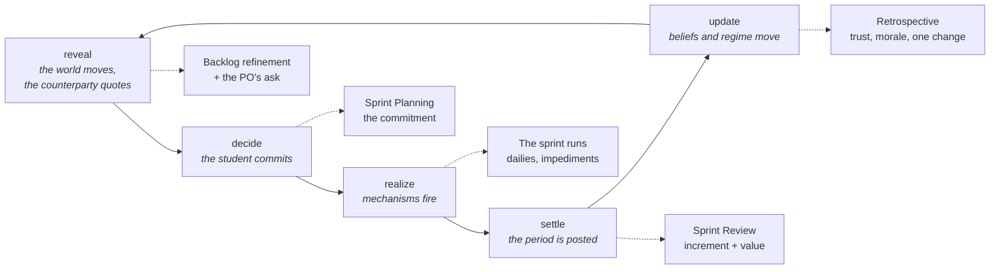
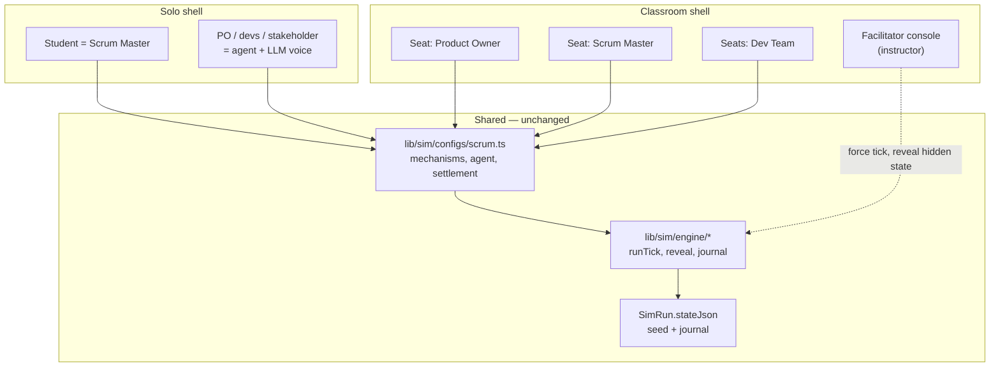

# Sprint Room — a Scrum roleplay simulator

A plan for teaching Scrum the way this codebase already teaches unit economics: by making
students **live with the consequences** of their decisions instead of reading definitions of
the ceremonies.

This is a design spec, not shipped code. It maps every Scrum concept onto machinery that
already exists in `lib/sim`, names the three small engine changes that do not exist yet, and
sequences the build so that something is playable long before everything is finished.

Companion reading: [`ARCHITECTURE.md`](./ARCHITECTURE.md) for the system this plugs into.

---

## 1. The teaching problem

Scrum is taught as vocabulary and examined as vocabulary. A student can define a sprint
retrospective, list the three roles and recite the Definition of Done, and still believe the
four things that actually matter most:

1. that a team which commits to more will deliver more;
2. that running the team at 100% utilisation is efficient;
3. that skipping tests to hit a date is a local, one-sprint trade;
4. that stakeholder trust is won by promising well rather than by delivering predictably.

Every one of those is false, and none of them can be *argued* away — a student who is told
"WIP limits improve throughput" files it next to the definitions. What changes their mind is
committing 45 points against a capacity of 32, watching carryover eat the next sprint, and
having the Product Owner turn up in sprint 4 asking for a date because they no longer believe
the forecast.

So the design goal is not a quiz and not a chatbot. It is a **deterministic causal model that
answers a student's decisions with consequences**, wrapped in characters who make those
consequences arrive as a conversation. That is exactly the posture the decision-simulation
format already takes ("answers with consequences rather than a mark"), which is why this
belongs in this repo rather than in a new one.

---

## 2. The claim this whole design rests on

**Scrum's events are already the engine's tick phases.** The five-phase tick in
`lib/sim/engine/time.ts` was written for a supply-chain contract, and it lands on the Scrum
cycle without being bent:

Two properties of that ordering are load-bearing, and both are already argued for in
`time.ts`:

- **`reveal` before `decide`** — the Product Owner's stance is information you plan *against*,
  not a consequence of what you chose. That is what makes Sprint Planning a decision under
  uncertainty rather than a formality.
- **`update` last** — a belief shift lands as *next* sprint's problem. A team that overcommits
  in sprint 3 does not feel it in sprint 3; they feel it when the PO stops protecting the sprint
  goal in sprint 4. Delayed consequence is the single hardest thing to teach with a lecture and
  the easiest thing to teach with a loop.

Everything below is downstream of this fit. If the tick had not matched the ceremonies, the
honest recommendation would have been a separate format with its own loop.

---

## 3. What is reused, not rebuilt

| Need | Existing machinery | Change needed |
|---|---|---|
| The sprint loop | `lib/sim/engine/time.ts` (`runTick`, `reveal`) | none |
| Hidden context (calm quarter vs crunch) | `RegimeConfig` + `hmmStep` | none |
| Correlated bad luck | `correlatedShocks` | none |
| The 100%-utilisation cliff | `queue` mechanism, `ρ/(1−ρ)` | none |
| Stakeholder trust | `bayesBelief` mechanism | none |
| A PO who *decides* rather than obeys | `lib/sim/engine/agent.ts` softmax utility | none |
| Stocks (tech debt, backlog, morale) | `accumulate` derivation | none |
| Impediments that are not scripted | `ScenarioConfig` tail-draw triggers | none |
| Replayable, resumable runs | `journal.ts` + `SimRun.stateJson` + `seed` | none |
| Value delivered, discounted | `financials.ts` (`rollingNpv`) | one rename (§9) |
| Scoring against a rubric | `weightedOverallFor`, `SimResult.scoresJson` | none |
| In-character dialogue with offline fallback | `lib/llm` adapter + `mock.ts` + `SimMentor` | new prompts |
| Catalogue, XP, leaderboard, entitlements | `Question` + `SimRun` + `SimResult` | seed rows only |

The config-driven seam (`SimulatorConfig` → `lib/sim/configs/buyback.ts`) was built with a
second domain explicitly in mind: *"if a second domain cannot be expressed without editing an
engine, the split failed."* Scrum is that second domain, and it very nearly passes clean —
three small gaps are named in §9 rather than hidden.

**No database migration is needed for the solo game.** `SimRun` already carries `seed` and
`stateJson`, which is where the journal lives. Classroom mode (§8) is the only part that adds
tables.

---

## 4. The state model

State keys are the config's vocabulary, never the engine's. Hidden keys are withheld from the
student mid-run and released in the debrief — which is what makes forecasting a skill rather
than a lookup.

| Scrum concept | State key | Kind | Why it is modelled this way |
|---|---|---|---|
| Product backlog | `backlogPoints` | `accumulate` | Work arrives and is consumed. A stock, so it can grow while you are busy. |
| Sprint commitment | `commitPoints` | decision | What the team says it will do. |
| Delivered | `deliveredPoints` | derived `min` | You cannot deliver more than you finished *or* more than you committed. |
| Velocity | `velocity` | derived, trailing mean | **Measured, never set.** Students may not type a velocity. |
| True capacity | `trueCapacity` | **hidden** | The number velocity is an estimate *of*. Hiding it is the whole forecasting lesson. |
| Focus factor | `focusFactor` | input | Meetings, support, context switching. |
| Utilisation | `utilisation` | derived `ratio` | `commitPoints ÷ trueCapacity` — feeds the queue. |
| Cycle time | `cycleTime` | `queue` mechanism | Convex in utilisation. The cliff. |
| Work in progress | `wip` | `accumulate` | Carryover is WIP that did not finish. |
| Technical debt | `techDebt` | `accumulate` | Inflow from shortcuts, outflow from paydown. Never floors at zero by accident. |
| Definition of Done adherence | `dodStrictness` | decision | Buys `doneYield`, costs capacity. |
| Escaped defects | `escapedDefects` | `betaYield` | A proportion, drawn — not a formula the student can game. |
| Team morale | `morale` | `accumulate`, floored | Overtime and thrash drain it; finishing things restores it. |
| Stakeholder trust | `stakeholderTrust` | `bayesBelief` | Reads say-do ratio. Slow up, fast down. |
| Say-do ratio | `sayDoRatio` | derived `ratio` | `deliveredPoints ÷ commitPoints`, clamped to 1. |
| Released value | `releasedValue` | derived `product` | Only *released* work earns. Undone work is inventory. |
| Unreleased increment | `unreleasedValue` | derived | Carried as a balance-sheet asset that has not become cash. |

The last row is the quiet one. Modelling unfinished work as **inventory on a balance sheet**
is not a metaphor stretched for the sake of reuse — it is the Lean argument for small batches,
stated in the only language a finance-literate stakeholder accepts. A student who watches
`unreleasedValue` climb while cash does not has understood something a burndown chart cannot
show them.

---

## 5. The four mechanisms, and what each one teaches

Every mechanism already exists in `lib/sim/engine/transition.ts`. Nothing here is new maths.

### 5.1 `queue` — why 100% utilisation is a trap

`cycleTime = baseTime · (1 + ρ/(1−ρ))` where `ρ = commitPoints ÷ trueCapacity`.

Going from 70% to 80% loaded adds about a third of the base cycle time; 90% to 95% adds two
more. A student who fills every point of capacity every sprint does not get more output, they
get a queue — carryover, longer cycle time, and a burndown that flatlines until the last day.

This is the mechanism that makes "commit to less and finish it" a *discovery* instead of
advice. It is modelled rather than asserted, exactly as `transition.ts` argues.

### 5.2 `bayesBelief` — why trust is asymmetric

`stakeholderTrust` is a Beta posterior updated each sprint by the observed `sayDoRatio`, with
`decay` forgetting old evidence slowly.

The consequences: one good sprint after a bad quarter barely moves it; three missed
commitments move it a long way; and recovery is possible but takes longer than the damage did.
There is **no threshold anywhere** — no `if (trust < 0.5)`. The PO's behaviour changes because
a posterior moved and the utility reading it moved, which produces a drift a student has to
read rather than a cliff they learn to stand next to.

### 5.3 `betaYield` — why the Definition of Done is not paperwork

`doneYield` is *drawn*, not computed: the fraction of committed work that genuinely meets the
Definition of Done, with the distribution shaped by `dodStrictness`.

Because it is a draw, a student cannot learn "spend 20% on quality and get exactly this". They
learn a distribution — that cutting DoD raises the *variance* of delivery before it raises the
mean of defects, which is precisely why teams get away with it for two sprints and then do not.

Escaped defects feed back as unplanned work in later sprints, so quality is not a moral
position in this model. It is interest on a loan.

### 5.4 `elasticity` — why debt compounds

`effectiveCapacity` responds to `techDebt` with constant elasticity: the drag from the first
increment of debt is small, and the drag from debt on top of debt is not. A linear penalty
would teach that debt is a fixed tax, which is the misconception, not the lesson.

---

## 6. The Product Owner is an agent, not a script

The most important design decision in the whole simulator: **the counterparty decides.**

`lib/sim/engine/agent.ts` scores each available action with a weighted utility, penalises the
action's *exposure* by `(1 − belief)`, softmaxes and samples. Ported to Scrum, the PO's actions
each sprint are:

| Action | Offers | What the student sees |
|---|---|---|
| Protect the sprint goal | low `scopeInjection`, high `goalClarity` | "It can wait. Ship what you committed." |
| Standard ask | moderate both | A normal refinement conversation. |
| Push a hot request mid-sprint | high `scopeInjection` | "Sales promised this Friday. Can we squeeze it in?" |
| Ask for a date | high `datePressure`, low `goalClarity` | "I need a commitment I can put on a slide." |

Utility terms: `businessValue`, `predictability`, and `exposure` — where exposure is the risk
the PO carries by trusting the team's forecast. Belief is `stakeholderTrust`.

The emergent behaviour is the entire pedagogy of the simulator:

- A team with a strong say-do ratio gets a PO who **protects the sprint** — because trusting
  them is cheap.
- A team that keeps missing gets a PO who **injects scope and demands dates** — because the
  exposure penalty has made protection expensive.

Students discover that the Scrum Master's job is not to defend a ceremony but to **rebuild a
posterior**, and that the fastest way to stop being micromanaged is to commit to less and hit
it. Nobody has to say this out loud. It falls out of the softmax.

---

## 7. One sprint, end to end

### 7.1 What the student decides

| Key | Kind | Range | The trade |
|---|---|---|---|
| `commitPoints` | integer | 0–60 | Against a velocity they must estimate themselves. |
| `dodStrictness` | integer (%) | 0–100 | Quality capacity vs. feature capacity. |
| `debtPaydown` | integer | 0–20 | Points spent on refactoring instead of features. |
| `wipLimit` | integer | 1–12 | Flow discipline. Low limits feel slow and are not. |
| `scopeResponse` | choice | accept / negotiate / defer | The answer to the PO's mid-sprint ask. |
| `overtime` | integer (%) | 0–30 | Borrows capacity from next sprint's morale. Always a loan. |

`scopeResponse` needs a config-level `kind: "choice"` — see §9.

### 7.2 How a sprint becomes money

The settlement contract already has three slots, and Scrum fills all three:

- **revenue** — `deliveredValuePoints × valuePerPoint`, realised only on *released* work.
- **cost of goods** — the team's sprint cost. Fixed whether or not anything ships, which is
  the fact that makes idle capacity feel expensive and half-done work feel free. It is not.
- **contract** — the incident line: `escapedDefects × costPerIncident`, negative. The buyback
  slot, used for the settlement that actually exists in software.

NPV discounts value by when it arrived, so **shipping in sprint 2 is worth more than shipping
the same thing in sprint 8**. That is the argument for iterative delivery expressed as
arithmetic rather than as a principle, and it is free — `rollingNpv` already does it.

### 7.3 KPIs and the scorecard

| KPI | Formula (existing `KpiFormula` kinds) | Teaches |
|---|---|---|
| Value delivered | `npv` | Value is time-sensitive. |
| Say-do ratio | `ratioOfSums(deliveredPoints, commitPoints)` | Predictability beats ambition. |
| Flow | `turnover(deliveredPoints, wip)` | Little's Law: throughput ÷ WIP. |
| Escape rate | `ratioOfSums(escapedDefects, deliveredStories)` | Quality is a rate, not an event. |
| Debt ratio | `ratioOfSums(techDebt, codebaseSize)` | Debt as a share, not a number. |

Rubric (read off the config, as `buybackFormat` already does):

| Dimension | Weight | Hint shown to the student |
|---|---|---|
| Predictability | 1.5 | Did the team deliver what it committed, sprint after sprint? |
| Flow | 1.2 | Did work finish, or did it pile up in progress? |
| Quality | 1.2 | Did the Definition of Done survive contact with a deadline? |
| Value | 1.5 | What reached users, and how early? |
| Adaptation | 1.0 | Did each retrospective act on what the sprint actually showed? |

Adaptation is deliberately weighted below Predictability and Value: a student who changes
something every sprint is not adapting, they are thrashing, and the rubric should not pay them
for it. This mirrors the reasoning already written into `turnaroundRubric`.

### 7.4 Impediments arrive from the tail, never from the calendar

`ScenarioConfig` fires on **percentiles of a draw**, not on a tick index. So:

- `atOrBelow: 0.08` on the yield draw → "A production incident took Tuesday and Wednesday."
- `atOrAbove: 0.92` on the demand draw → "Sales closed a lighthouse account. Everyone wants a date."
- `atOrBelow: 0.05` on the capacity draw → "Two of the team are out sick."

The same config produces an incident in sprint 2 of one run and sprint 7 of another, and
sometimes not at all. Students replaying the scenario cannot memorise the script, because
there is no script — which is what makes a second playthrough a different lesson rather than a
faster one.

---

## 8. Two shells on one engine: solo and classroom

Both modes were asked for, and the way to get both without building the thing twice is a
single rule:

> **The decision vector is the unit of play. A "seat" is just who fills which keys of it.**

The journal already records `decision: Record<string, number>` per tick. Solo play means one
player fills every key. Classroom play means the keys are partitioned across seats and the tick
runs when every seat has committed. The engine does not learn the difference.

### 8.1 Which seat owns which keys

| Seat | Owns | Argues about |
|---|---|---|
| Product Owner | backlog ordering, `valuePerPoint` priorities, the sprint goal | whether the hot request is really urgent |
| Dev Team | estimates, `commitPoints`, `debtPaydown` | what is actually achievable |
| Scrum Master | `wipLimit`, `dodStrictness`, impediment escalation | protecting the sprint vs. serving the stakeholder |
| Stakeholder | optional human seat; otherwise played by the agent | the date |
| Facilitator | no decision keys | forces the tick, pauses, reveals hidden state at debrief |

The classroom mode's real value is not the software. It is that **the humans disagree and the
engine settles it**: the PO seat and the dev seats negotiate a commitment out loud, and the
queue and the debt stock answer them two sprints later with nobody's opinion involved. An
instructor cannot manufacture that with a slide deck, and a single-player game cannot
manufacture the argument.

### 8.2 What classroom mode adds

- **Schema**: `SimRoom` (code, facilitator, config slug, phase) and `SimSeat` (room, user,
  role, ready flag). The run itself stays a `SimRun`, so results, XP, leaderboards and
  entitlements keep working untouched.
- **Journal authorship**: each entry gains `by: Record<string, string>` — decision key → seat
  id. Optional, so solo journals stay exactly as they are today.
- **Sync**: server actions plus **SSE**, not websockets. A sprint is a classroom minute, not a
  game frame; the repo already streams NDJSON (`lib/llm/stream.ts`), so this needs no new
  dependency and no stateful socket server.
- **Facilitator console**: burndown, trust, the PO's current stance, per-seat ready state, a
  "force the sprint" button for the team still arguing, and a debrief-time reveal of the hidden
  regime and `trueCapacity`.

Classroom mode is sequenced **last** (§11) not because it matters least but because it is the
only part that is worthless without everything before it working.

---

## 9. The three engine changes this actually needs

The config seam holds up well, and where it does not, the gaps are small and worth naming
plainly.

**1. `inventoryValue` is supply-chain vocabulary sitting in a shared engine.**
`postPeriod` in `financials.ts` takes an `inventoryValue` argument, and `time.ts` reads
`working.inventoryValue` by name. That is this domain's word inside the engine — the exact
failure the prohibition test in `tests/buyback-behaviours.test.ts` exists to catch. It survives
today only because the regex is `\binventory\b` and the identifier is camelCase.

*Fix:* rename to `heldAssetValue` and read it from a new `settlement.heldAssetKey` in the
config. Scrum points it at `unreleasedValue`; buyback points it at `inventoryValue`; behaviour
is bit-identical for existing runs.

**2. `betaYield` cannot respond to a decision.**
Its `alpha`/`beta` are config constants, so the student's `dodStrictness` cannot move the
distribution — and a Definition of Done that changes nothing is not worth simulating.

*Fix:* optional `alphaKey`/`betaKey` state-key overrides alongside the constants. Still
declared as data, still no domain code in the engine, and the constants remain the fallback so
`buybackConfig` does not change.

**3. Decisions can only be numbers.**
`DecisionVariableConfig.kind` is `"integer" | "currency"`, and `scopeResponse` is a choice
between three named stances. Integer-coding it (0/1/2) would work and would read as a hack in
both the UI and the debrief.

*Fix:* add `kind: "choice"` with labelled options. The decision vector stays numeric, so the
engine, the journal and every counterfactual are untouched — this is a config and UI change
wearing an engine-shaped hat.

Each change ships with tests, and the prohibition suite must stay green. Note that `backlog` is
on the engine's forbidden-word list; in this design it appears only in `lib/sim/configs/scrum.ts`
and the UI, which is exactly where domain vocabulary belongs.

---

## 10. The roleplay layer

What makes this a roleplay simulator rather than a dashboard is that consequences arrive as
people talking. What keeps it *honest* is three rules, in priority order.

**Rule 1 — the engine decides, the LLM only voices.**
Every character line is generated *from* a resolved tick: the state deltas, the agent's chosen
action, the impediments that fired. The LLM never changes state, never scores, never invents a
number. This is the same contract the sim coach already honours, and it is why a run stays
replayable from its seed.

**Rule 2 — characters are personas over the agent's chosen action.**
The softmax picks "push a hot request"; the LLM renders it as the PO speaking in character.
Every `AgentActionConfig` also carries authored dialogue, so when no key is configured the mock
adapter speaks the authored line instead. The simulator stays **fully playable with zero keys**
— the repo's central promise — and the LLM upgrades the prose rather than enabling the game.

**Rule 3 — student speech is parsed into the decision vector, never into outcomes.**
In roleplay mode a student types *"I'd rather protect the sprint goal and pull it into next
sprint"*, and the LLM's only job is to map that to `scopeResponse = defer` with a confidence.
Low confidence asks a clarifying question in character instead of guessing. Free-form
conversation, deterministic consequences, and a debrief that can prove what happened.

The cast: the Product Owner (the agent), a Tech Lead (voices the debt and the queue without
naming them), a Stakeholder (dates), and a Scrum Master coach for the debrief — reusing the
existing `SimMentor` seam, because a "senior product leader" debriefing a sprint would be the
same small lie the mentor field was added to prevent.

A concept primer runs first, following the existing `plain` before `formula` convention:
velocity, story point, Definition of Done, WIP, burndown, say-do ratio, carryover.

---

## 11. Build order

Each phase is independently useful, and the game is playable from phase 2.

| Phase | Deliverable | Done when |
|---|---|---|
| **0** | The three engine changes (§9) | Prohibition suite green; buyback runs bit-identical |
| **1** | `lib/sim/configs/scrum.ts`, `scrumFormat`, validation, golden tests | A full 8-sprint run resolves headlessly and deterministically from a seed |
| **2** | Solo UI: ceremonies as phases, burndown, PO panel, catalogue seed rows | A student can play a scenario start to finish |
| **3** | Roleplay layer: authored dialogue, `/api/scrum-turn`, intent parsing, mock fallback | Playable in conversation with no API key set |
| **4** | Debrief: rubric scoring, counterfactual replay, Monte Carlo forecast | A finished run explains itself; **also finishes the shared debrief the buyback format still redirects away from** |
| **5** | Classroom rooms: `SimRoom`/`SimSeat`, SSE, facilitator console | Four students and an instructor complete a sprint together |
| **6** | Instructor kit: facilitator guide, learning-objective map, assessment export | A teacher can run a 90-minute session from the doc alone |

Content, authored alongside phases 1–2 and in Indian context per the repo convention:

1. **First three sprints** (beginner, 6 sprints, calm regime) — velocity, commitment, carryover.
2. **The date on the slide** (intermediate, 8 sprints, date pressure) — forecasting under
   uncertainty, and trust as the thing you spend.
3. **Paying the interest** (advanced, 10 sprints, high opening `techDebt`) — debt as a stock,
   and why the sprint that fixes it looks like the worst sprint of the run.

---

## 12. Risks, and the ones that will actually bite

- **Teaching ritual instead of outcomes.** The largest pedagogical risk. If the rubric rewards
  holding a ceremony, the simulator manufactures cargo cult. Nothing in §7.3 scores attendance
  — every dimension scores a consequence, and that must survive review.
- **Velocity must be estimated, never displayed as truth.** If `trueCapacity` leaks into the UI,
  the forecasting lesson evaporates. It belongs in `hiddenKeys`, and a test should assert it.
- **The LLM drifting into authority.** A model that answers "should we commit to 40?" with a
  number has replaced the engine. Prompts must refuse forecasts and reflect the question back —
  the same Socratic discipline `prompts.ts` already enforces for the interviewer.
- **The buyback debrief is unfinished** (`app/simulate/[runId]/page.tsx` redirects to the
  catalogue when a config-driven run reaches debrief). Phase 4 should complete that shared path
  rather than fork a second one.
- **Scope.** Phase 5 is roughly as large as phases 0–4 combined. It is sequenced last so that
  descoping it costs a feature rather than the product.
- **Over-modelling.** Morale, debt, defects, trust, flow and value is already a lot of coupled
  state. Each mechanism must earn its place by teaching something a student can name afterwards,
  or it is complexity the debrief cannot explain.

---

## 13. Open questions

1. **Sprint length in play time.** A tick is one sprint; is a solo run 8 ticks of ~3 minutes,
   or a longer session with refinement between? This sets how much dialogue each tick can carry.
2. **Who the student is by default.** Scrum Master is the recommended default seat — it is the
   role with levers and no authority, which is the interesting one — but Product Owner is the
   better fit for this app's existing PM audience.
3. **Assessment.** Does an instructor need a per-student export (decisions, rubric, transcript)
   for grading, or is the in-app debrief enough?
4. **Framework breadth.** Kanban and SAFe are expressible in the same config seam. Worth
   confirming Scrum-only for v1 rather than building a generic agile simulator that teaches
   nothing specific well.
