# CASE CLOSED — User Guide

<!--
  Authoring source for docs/USER_GUIDE.docx and docs/USER_GUIDE.pdf.
  Edit here, then run:  node docs/user-guide/build.mjs

  Supported markdown: # ## ### headings, paragraphs, - bullets, 1. numbered
  lists, | pipe tables |, > callouts,  figures,
  --- page breaks, **bold** and `code` inline.
-->

## 1. What CASE CLOSED is

CASE CLOSED is a practice platform for consulting and product-management interviews, built for
the PGP cohort at IIM Visakhapatnam. It gives you the one thing that is hardest to arrange for
yourself: a partner who will sit through a case with you, at any hour, as many times as you want.

Three kinds of exercise sit on it.

- A **guesstimate** asks you to size something — cups of chai drunk in Bangalore in a day, tubes
  of toothpaste sold in India in a year. You break the problem into a chain of assumptions and
  commit to a number.
- A **case** asks you to diagnose a business problem and recommend something. You are judged on
  whether your issue tree actually found the cause, not on whether you produced a tidy framework.
- A **war room** is not answered at all. It is played. You read a live dashboard, commit to a
  hypothesis, spend a limited research budget, name a root cause, and put money and engineering
  capacity behind a fix. The business then moves, and you see what your decision did to it.

Every question is India-context: rupees, Indian cities, Indian companies. All of it.

**What makes it different from a question bank.** The AI interviewer does not hand you answers.
It asks the next question a real interviewer would ask, gives hints that escalate only when you
ask for them, and holds the sample solution back until you have submitted. When you do submit,
you get a scored report that names what cost you marks — which branch of your tree nobody
examined, which assumption you never justified, how far out your number landed and in which
direction.

**For faculty**, the same content runs as a class exercise. You pick a war room or a guesstimate,
read out a six-character code, and the class works it on their own laptops while you watch a live
roster: who has joined, where each student is, what they concluded. Students need no account to
take part.

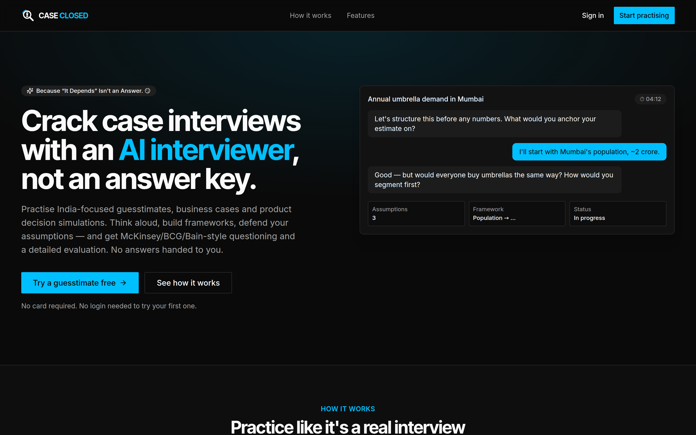

---

## 2. How the platform is organised

Once you are signed in, everything is reachable from the bar across the top of every page.

| Link | What it holds |
|---|---|
| **Dashboard** | Today's questions, your progress, your rank and your recent work |
| **Library** | The full catalogue of guesstimates and cases |
| **War rooms** | The decision simulations, and their own leaderboard |
| **Arena** | A multi-quarter match against rival firms. Only appears if an administrator has granted it to your account |
| **Host** | Classroom rooms. Only appears for professors and administrators |
| **Admin** | The administration panel. Administrators only |
| **Join room** | Enter a class code your professor has read out |

> Links you do not see are links you do not have. Most students see Dashboard, Library, War rooms
> and Join room, and nothing else — that is the normal view, not a missing feature.

---

## 3. Getting started

### Trying it without an account

You do not need to sign up to try CASE CLOSED. From the landing page, choose **Try a guesstimate
free** or **Start practising**. You get a sample of each format — one guesstimate, one case and
one war room — and you may replay them as often as you like.

What you do not get as a guest is memory. Nothing is saved, no score is recorded, and there is no
streak or rank. Creating an account keeps everything you have already done: your work is carried
over, not discarded.

### Creating your account

1. Choose **Sign up free** in the top-right corner.
2. Enter your name, your email address and a password.
3. Answer the two short questions on the welcome screen.

The second step matters. **Your batch is the only required answer** — PGP-1 or PGP-2 — because
it appears next to your name on every leaderboard, and a row nobody can place is a row nobody can
read. Your profession and the interviews you are targeting are optional; if you fill them in, the
Library sorts those questions first and the Dashboard recommends against them.

### Signing in again

Choose **Sign in** and enter the email and password you registered with. Your session lasts 30
days on that browser.

### If you forget your password

There is no automatic reset email. Instead:

1. Choose **Forgot password?** on the sign-in screen and email the address shown there **from
   your official IIM Visakhapatnam email account**.
2. The administrator resets your password to **your own email address**. That is the temporary
   password.
3. Sign in with it. You will be asked to choose a new password before you can go anywhere else.

The reset is done by a person, so it is not instant. Ask in good time, not ten minutes before a
class exercise.

---

## 4. Your dashboard

The Dashboard is where you land after signing in, and it is designed to answer one question: what
should I do today?

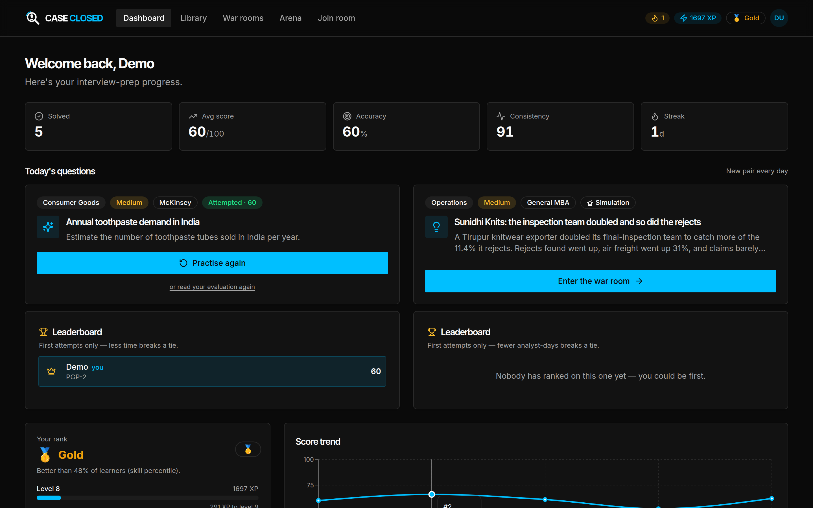

**Today's questions.** A new guesstimate and a new war room open every day, the same pair for the
whole cohort. Working the daily pair is the cheapest way to build a streak, and because everyone
gets the same two, the small leaderboard beneath each one is a fair comparison.

**The five figures across the top.**

| Figure | What it counts |
|---|---|
| Solved | Questions you have submitted and had scored |
| Avg score | Your mean score out of 100 across those |
| Accuracy | The share of your guesstimates that landed inside the accepted range |
| Consistency | How steady your scores are — high means few surprises, not high marks |
| Streak | Consecutive days you have practised |

**Your rank** sits below, with your level and XP. **Score trend** plots your scores in order so
you can see whether you are actually improving. **Skill breakdown** and **Focus areas** split
your scores by category and name your two or three weakest ones — start there rather than with
whatever question looks most interesting.

---

## 5. The Question Library

The Library holds every guesstimate and case on the platform.

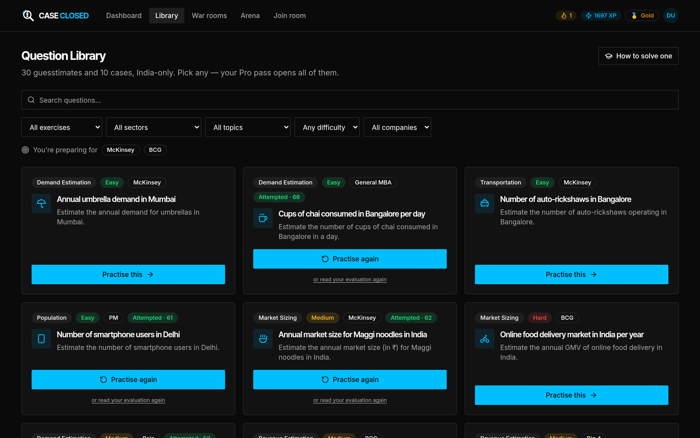

Each card shows the topic, the difficulty, and the firm whose interviews the question is typical
of. Use the search box for a keyword, or narrow with the five filters: exercise type, sector,
topic, difficulty and company. If you told the platform which interviews you are preparing for,
those appear as chips under the filters and the list is already sorted for them.

**How to solve one**, in the top-right corner, opens a fully worked example — a real guesstimate
taken from the opening question to the final number. It is worth ten minutes before your first
attempt.

**Locked cards.** Your account has a tier, and the tier decides how much of the Library you can
open.

| Tier | Who has it | What it opens |
|---|---|---|
| Guest | Anyone, no account | One guesstimate, one case, one war room |
| Free | Any registered account | The same three, plus saved progress, streaks and a rank |
| Pro | An account granted a Pro pass | The whole Library |

A Pro pass is granted by an administrator and runs for a fixed period; your profile shows how many
days are left on it. Sitting in a classroom room is a separate thing entirely — it opens that
room's one question for as long as the room is open, whatever tier you are on.

---

## 6. Practising a guesstimate or a case

Choose **Practise this** on any card and you arrive at the practice screen. It has three parts.

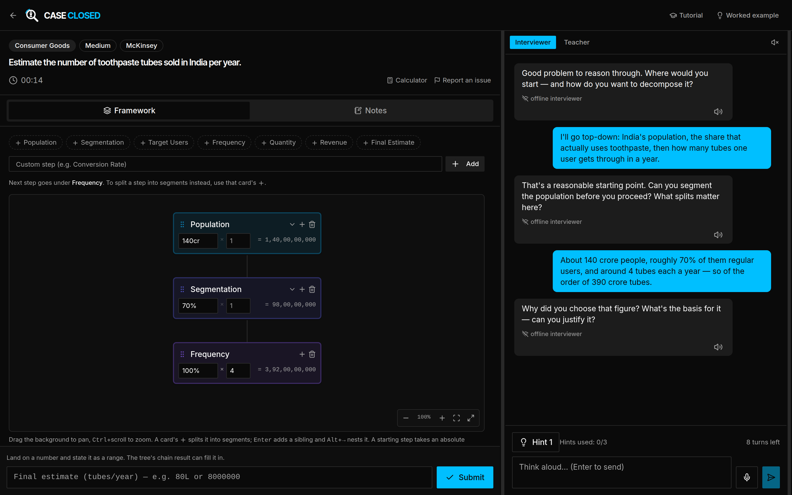

### The interviewer, on the right

Type into the box at the bottom and press Enter. The interviewer replies the way a real one
would — by asking the next question, not by answering yours. Think aloud here: what you say is
scored, and an attempt worked in silence loses marks on Interaction no matter how good the
arithmetic is.

You have **10 turns per question**. That is a budget, not a punishment — a known ceiling makes you
decide what to ask before you ask it, which is the skill being practised. The counter sits above
the message box.

Two tabs sit at the top of the panel:

- **Interviewer** — the default. Asks questions, never gives the answer away.
- **Teacher** — explains the solution instead. Useful when you are stuck and want to learn the
  method rather than be tested on it.

> **An attempt that used Teacher mode is not scored.** You are shown the answer, so there is
> nothing left to measure. The platform warns you before you switch, and the attempt still appears
> in your history — marked as unscored. Use Teacher mode deliberately, not by accident.

**Hint** gives you a nudge without giving the answer. There are three levels, each more explicit
than the last, and how many you used is on the record.

### The framework builder, on the left

This is where you actually structure the problem, and it is scored.

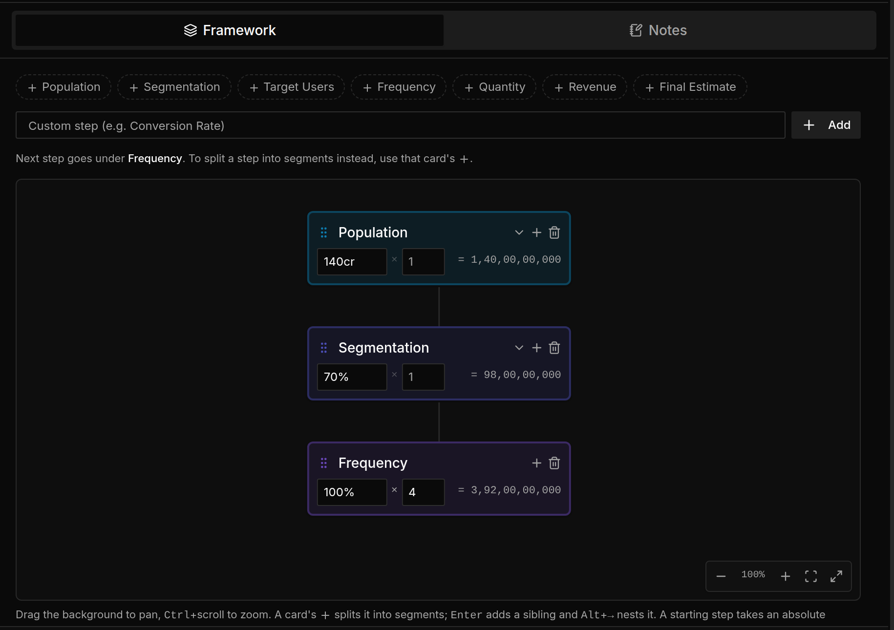

Add a step with one of the chips along the top — Population, Segmentation, Target Users,
Frequency, Quantity, Revenue, Final Estimate — or type your own into the box and choose **Add**.
Each step takes a value or a percentage and an optional multiplier, and the chain result appears
to the right of each card, so you can see your estimate build up as you go.

- A card's **+** splits that step into segments, so you can break a population into groups that
  are treated differently.
- On a case, mark each branch **Not examined**, **Healthy** or **Problem** as you work through it.
  The report checks whether the branches you judged are the ones you actually asked about.
- Drag the background to pan; Ctrl+scroll to zoom.

**Notes**, the second tab, is a scratchpad. It is saved on your device and is not part of your
answer.

### Your answer, along the bottom

Put your final number — or, on a case, your recommendation — in the box at the bottom and choose
**Submit**. You can write it as `80L`, `8000000` or `2cr × 0.7`; the platform reads Indian number
formats and simple arithmetic, and shows you what it read before you commit.

The **Calculator** at the top of the screen handles the arithmetic without you leaving the page.
**Report an issue** flags a question that looks wrong — a bad number, an unclear prompt — and goes
straight to the administrators.

> **Voice.** The microphone next to the message box dictates instead of typing, and the speaker
> icon reads the interviewer's replies aloud. Dictation works in Chrome and Edge only, and it sends
> your audio to Google's speech service to be transcribed. Everything else on the platform stays
> on the college's own server. If that matters to you, type.

---

## 7. Your evaluation report

Submitting ends the attempt and opens the report.

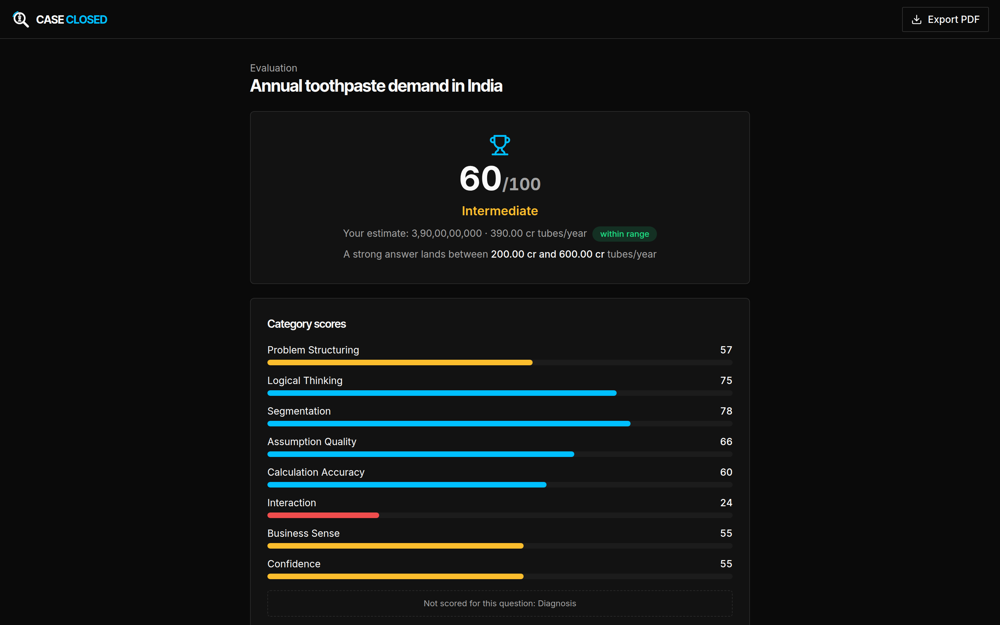

**The headline.** One score out of 100, and a readiness band:

| Band | Score |
|---|---|
| Interview Ready | 85 and above |
| Advanced | 70–84 |
| Intermediate | 50–69 |
| Beginner | below 50 |

On a guesstimate you also see your number against the range a strong answer lands in, and whether
you fell inside it.

**Category scores.** Nine categories exist; a guesstimate is scored on eight of them and a case on
seven, and the report says plainly which one was not scored and why.

| Category | What it measures |
|---|---|
| Problem Structuring | Whether you broke the problem up at all, and sensibly |
| Logical Thinking | Whether each step follows from the one before |
| Segmentation / MECE Coverage | Whether your segments are complete and don't overlap |
| Assumption Quality / Rationale Quality | Whether your numbers were justified or plucked |
| Calculation Accuracy | Arithmetic, and how close the answer landed |
| Diagnosis | On a case: whether your tree found the declared root cause |
| Interaction | How much you engaged the interviewer and reasoned out loud |
| Business Sense | Whether the answer would survive a business conversation |
| Confidence | Whether you committed to a position or hedged |

**The written feedback** below the scores is the part worth reading twice. Every observation quotes
your own work — which step's branches added to more than the whole, which box holds something that
is not a figure, how far out the answer landed. Each one names what it cost you, and the list is
ordered by impact, so the first thing you read is the thing that cost you most.

A miss that lands within a factor of ten, a hundred or a thousand is called a **unit slip** rather
than a judgement error, because that is almost always what it is.

The authored **consultant's angle** closes the report: how someone who does this for a living
would have approached it.

Submitting also pays out XP, extends your streak, may unlock an achievement, and updates your
percentile rank.

---

## 8. War rooms

A war room is a business in trouble and a quarter to fix it. There is no answer key — the
scenario runs on a causal model, and it replies to your decision with consequences.

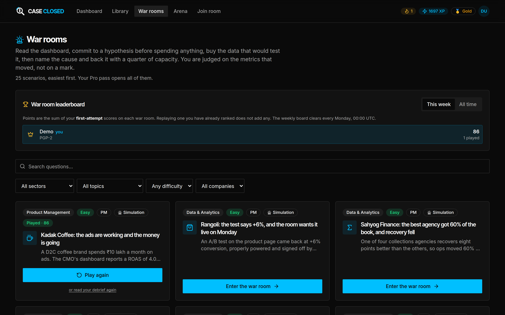

Choose **Enter the war room** on any card. A short primer opens first, explaining the vocabulary
that scenario uses; you can reopen it at any time from **Concepts** in the header.

Four phases run strictly forward. You cannot go back.

### 1. Observe

Read the board. Everything on the dashboard is one chain of arithmetic, laid out left to right,
and the number you are judged on is at the end of it.

Then commit: pick **at most three** hypotheses from the list and say in one line what you would
expect the data to show if you are right. You must do this **before you spend anything**, which is
the whole point — a hypothesis formed after the data arrives is not a hypothesis.

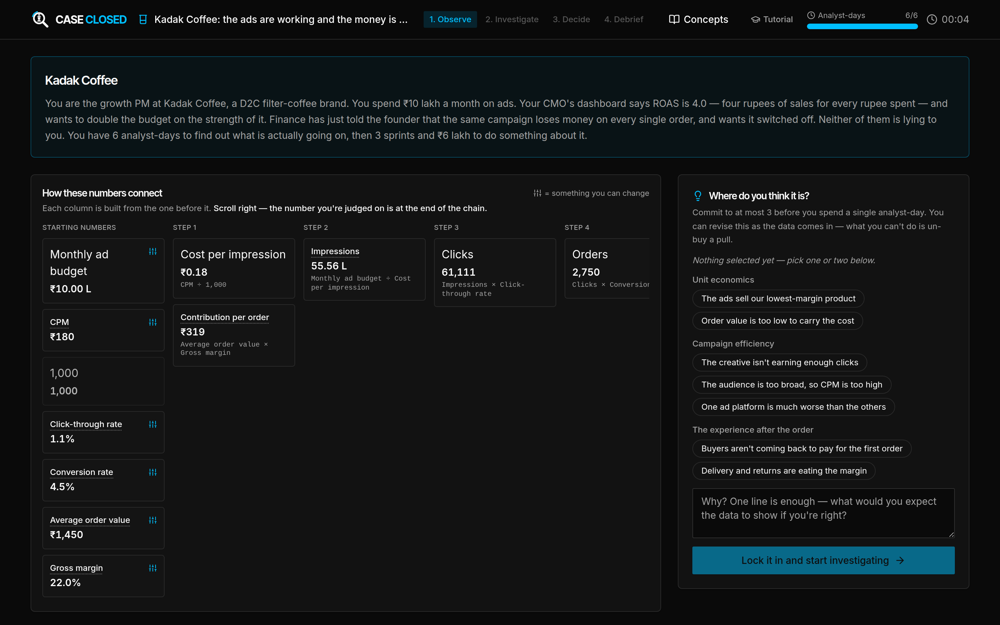

### 2. Investigate

You have a budget of **analyst-days** and a menu of analyses, each with a price. Buying one reveals
real data about the scenario. Spend them well: efficiency is scored, and analyst-days cannot be
recovered once spent.

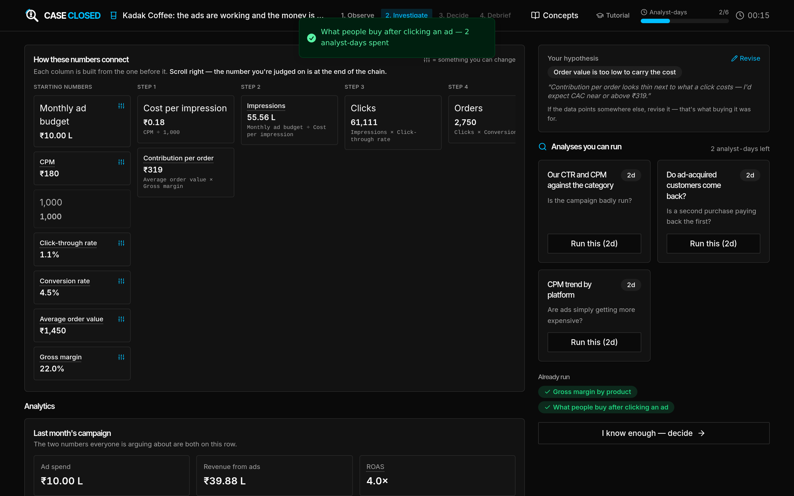

### 3. Decide

Name the root cause. **This locks.** From that point the board shows only the fixes that address
the cause you named, and nothing else can be bought — diagnosing one branch and then funding a fix
on another is not a thing you can do here, any more than you could in the business.

Then split a quarter of engineering capacity, in sprints, and a rupee budget across the fixes you
have chosen.

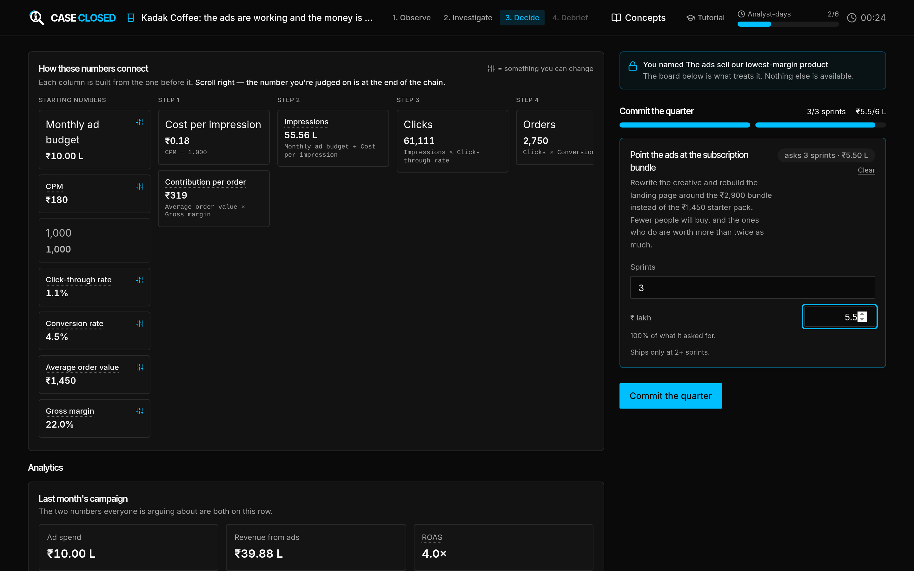

### 4. Debrief

The next two months are projected forward and reported as **moved metrics, not as a mark** —
orders, retention, margin, profit — each shown three ways: what you did, what doing nothing would
have done, and the best that budget could have achieved. The debrief then reveals the true causal
chain and compares your allocation to the best available one.

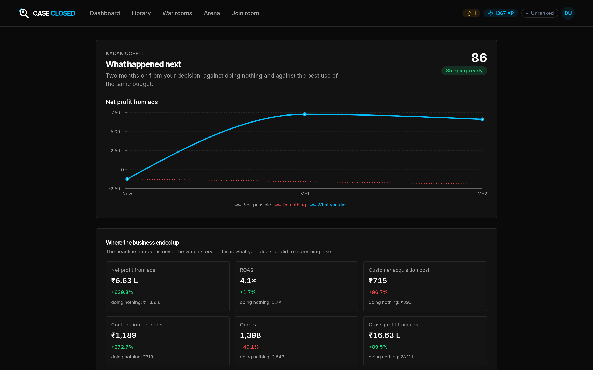

A war room is scored on its own five dimensions — **Hypothesis quality**, **Investigation
efficiency**, **Diagnosis accuracy**, **Decision quality** and **Outcome** — and its own bands:

| Band | Score |
|---|---|
| Shipping-ready | 85 and above |
| Strong | 70–84 |
| Developing | 50–69 |
| Reactive | below 50 |

---

## 9. The Arena

The Arena is an eight-quarter match played against three rival firms that respond to what you do,
scored on its own rubric. It is granted to one account at a time by an administrator, so most
people will never see the link. If you do, the lobby explains that game's premise before you join
a match.

---

## 10. Leaderboards, rank and streaks

**Leaderboards.** Each question has one, and there are cohort-wide boards for practice and for war
rooms, each with a **Today** and a **This week** view. Only your **first attempt** on a question
counts, so replaying something you have already ranked on will not move you up. Ties break on
less time taken for a guesstimate, and on fewer analyst-days spent for a war room. A row is your
first name, your batch and your points.

**Rank** is a percentile among ranked users on the platform, not a total of your XP. You stay
**Unranked** until you have **five graded attempts**, then you are placed:

| Rank | Percentile |
|---|---|
| Diamond | 90 and above |
| Platinum | 70–89 |
| Gold | 40–69 |
| Silver | below 40 |

**XP and levels** rise with everything you complete and never fall. **Streaks** count consecutive
days on which you practised. **Achievements** unlock quietly in the background; the Dashboard
shows which ones you have.

---

## 11. Your profile and account

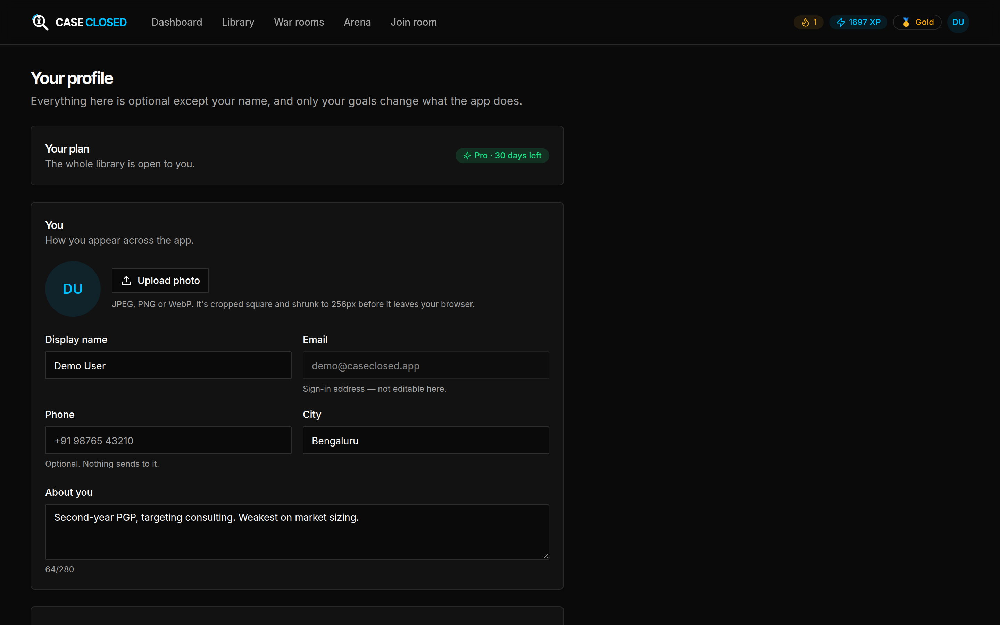

**Your plan** at the top shows your tier, and how many days are left on a Pro pass.

**You** holds your display name, an optional photo, phone and city, and a short bio. Only the name
and the batch are visible to anyone else — they appear on leaderboard rows. Photos are cropped and
shrunk in your browser before they are uploaded.

**Your goals** — the interviews you are targeting — change what the platform does: the Library
sorts to them, and the Dashboard recommends against them.

**Occupation.** Choosing *Professor* here does not make you one. It sends a request; an
administrator grants the role. See section 13.

You can also change your password here, and delete your account outright.

---

## 12. Joining a class exercise

Your professor will read out a six-character code and a password, or project a link. **You do not
need an account**, and you do not need to be signed in.

1. Go to **Join room** in the top bar, or open the link your professor projected.
2. Type the code. It is designed to be read aloud — if you hear "O" and it is a zero, or "I" and
   it is a one, the platform works it out. Case does not matter.
3. Type the room password.
4. Type your name **as your professor will recognise it**. "Roll 42" is more use to them than a
   nickname.

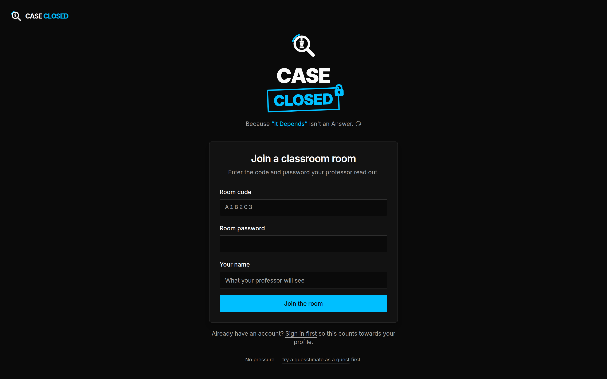

You then land on the room page, which holds one question and one button.

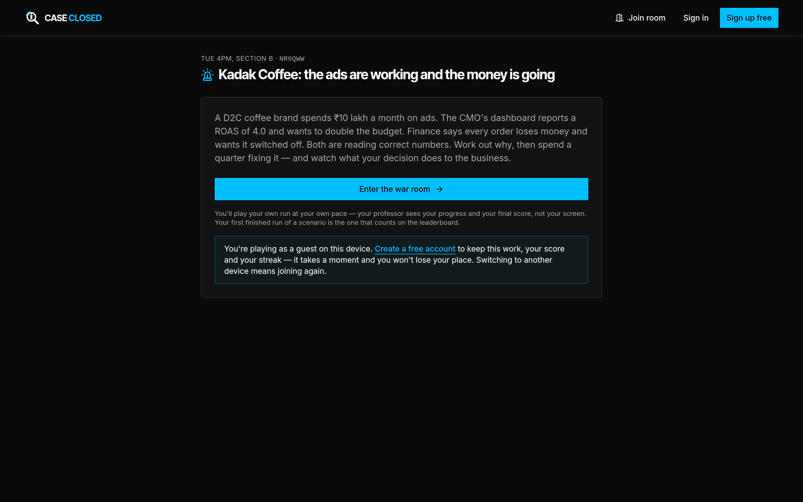

A few things worth knowing:

- **Only that one question opens.** The rest of the catalogue stays as it was.
- **You work at your own pace.** Everyone has their own copy. Your professor sees your progress and
  your final score, not your screen.
- **Class work is separate from your own.** If you have already attempted that question on your own
  account, the two do not mix, and neither replaces the other.
- **Sign up afterwards to keep it.** You are playing as a guest on that device. Creating an account
  keeps the work, the score and the streak, and you will not lose your place.
- **If the room closes while you are working, you carry on.** Closing a room stops new people
  joining and new runs starting. It never cuts off a run already in flight.

---

## 13. Hosting a class exercise (professors)

### Getting the role

Open your profile, set your occupation to **Professor**, and save. That records a request. An
administrator grants the role, and once granted a **Host** link appears in your top bar.

The role opens classroom rooms and nothing else — it is not an administrator account.

### Opening a room

1. Go to **War rooms** or **Library** and find the exercise you want to run.
2. Choose **host this in class**, beneath the card's main button.
3. Give the room a name your class will recognise — "Tue 4pm, Section B" — and set a password.
4. Choose **Open the room**.

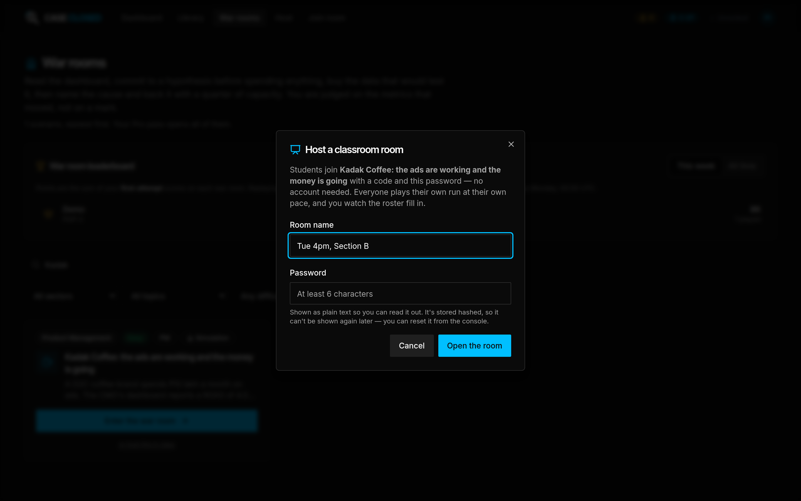

> You can only host an exercise **your own account can open**. If a war room is locked for you, its
> "host this in class" control is not there. Ask an administrator for a Pro pass alongside the role
> if you need the whole catalogue.

Both war rooms and guesstimates can be hosted. Cases cannot.

### Running the room

You land on the console. It shows the room code in large type, the join link to project, and the
roster, refreshed every five seconds.

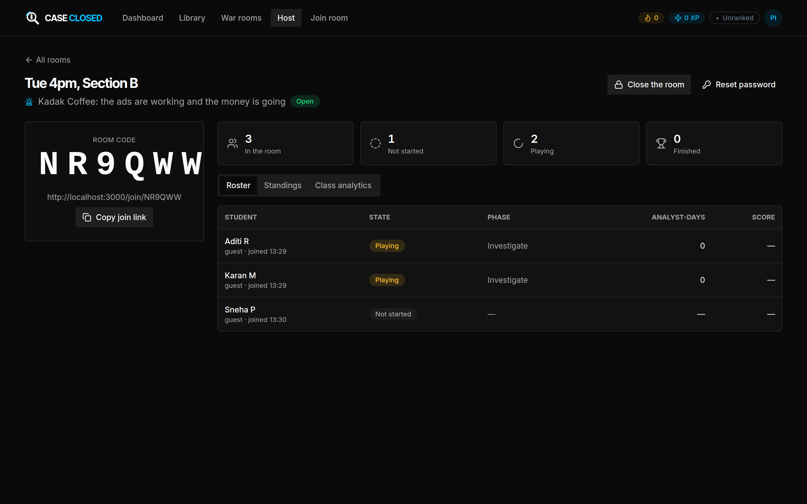

Three tabs sit under the counters:

- **Roster** — every student who has joined, whether they have started, which phase they are in,
  how many analyst-days they have spent and what they scored. A submitted attempt with no score
  reads *unscored* — that student used Teacher mode, which measures nothing.
- **Standings** — the same students ranked, with a scatter of analyst-days spent against score and
  a dashed line marking par.
- **Class analytics** — where the class is distributed across the phases, the average on each
  scored dimension, what they blamed, the spread of score bands, and cost against par. This is the
  view to put on the projector when you debrief the session.

**Close the room** stops new joins and new runs. Runs already in flight are untouched — nobody is
stranded six analyst-days into an investigation because you tidied up. **Reset password** issues a
new one if it gets out.

### Across rooms

The **Host** link itself shows everything you have run: how many students you have taught, how
many finished, the class average, the share who found the cause and came in under par, and a row
per exercise so two sittings of the same scenario can be compared. A student who sat in two of
your rooms is counted once.

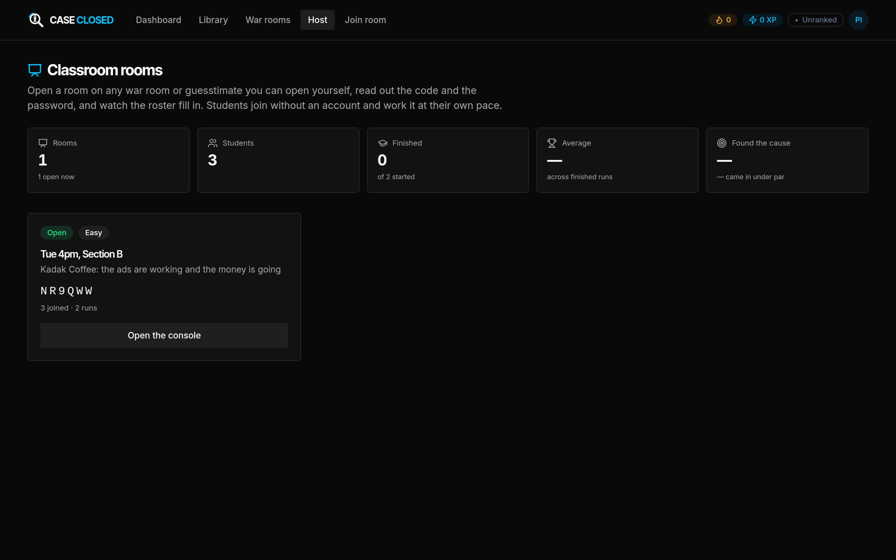

---

## 14. Questions people ask

**A question I want is locked. Why?**
Your account is on the guest or free tier, which opens one exercise of each kind. An administrator
grants a Pro pass for the rest. A room your professor opens is not affected by this.

**I scored zero on Interaction and I did the whole thing correctly.**
Interaction measures how much you engaged the interviewer — messages sent, reasoning said out
loud, figures justified. An attempt worked entirely in the framework builder, in silence, scores
nothing there. Think aloud.

**My attempt says it was not scored.**
You used Teacher mode. It states the answer, so there is nothing left to measure. Start a fresh
attempt in Interviewer mode.

**My answer was right but I scored badly.**
The number is one category of eight. Structure, segmentation, justified assumptions and engagement
carry more weight between them than accuracy does — which is how case interviews are actually
marked.

**The dictation button does nothing.**
It works in Chrome and Edge only. In other browsers, type.

**I already practised this question on my own; can I use that for the class?**
No, and you should not want to. Class attempts and solo attempts on the same question are separate
sittings. Your professor sees only the class one.

**Something in a question is wrong.**
Use **Report an issue** on the practice screen. It goes straight to the administrators with the
question attached.

**I can't sign in.**
See section 3. Resets go through the administrator, from your official college email address.

---

## 15. Glossary

| Term | Meaning |
|---|---|
| **Analyst-days** | The research budget in a war room. Each analysis costs some; they cannot be recovered |
| **Batch** | PGP-1 or PGP-2. Shown next to your name on every leaderboard |
| **Case (issue tree)** | An exercise ending in a recommendation, scored on whether your tree found the cause |
| **Classroom room** | A single exercise a professor opens for a class, entered with a code and password |
| **Framework builder** | The panel where you structure a guesstimate or case as a chain of steps |
| **Guesstimate** | An exercise ending in a number, scored against the range a strong answer lands in |
| **Host console** | The professor's live view of a room: roster, standings and class analytics |
| **Interviewer / Teacher** | The two AI modes. Interviewer asks; Teacher explains and leaves the attempt unscored |
| **Par** | The analyst-day spend a well-run investigation of that war room takes |
| **Pro pass** | A time-limited grant that opens the whole Library |
| **Readiness band** | The label on your score: Interview Ready, Advanced, Intermediate or Beginner |
| **Root cause** | The thing actually wrong in a war room. Naming it locks your options to fixes that address it |
| **Sprint** | A unit of engineering capacity you allocate in a war room's Decide phase |
| **Tier** | Guest, Free or Pro. Decides how much of the Library your account opens |
| **War room** | A decision simulation played over four phases, scored on what the business did next |
